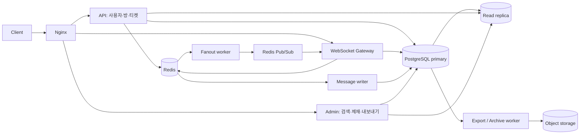

# 아키텍처 개요

이 문서는 현재 저장소의 구현을 설명한다. 10,000 동시 접속과 hot room 10,000 msg/sec는 설계 목표이며, 운영 성능을 인증한 수치가 아니다. 측정 조건과 결과는 [성능 기록](../README.md#성능-측정-기록), 배포 판단은 [운영 준비도](../operations/readiness.md)를 따른다.

## 역할과 데이터 흐름

- API, WebSocket, Admin, Worker는 실행 역할을 분리하고 공통 도메인·영속성 모듈을 사용한다. Worker 내부에서도 writer, fanout, room policy 등의 역할을 설정으로 선택한다.
- Primary는 사용자·멤버십·정책 변경과 canonical 메시지 저장을 담당한다. Read replica는 조회 부하를 분리하며 최신 history 조회에는 lag 기반 primary fallback이 있다.
- Redis Streams의 writer와 fanout consumer group은 독립적이다. DB 저장 완료와 실시간 전달 완료의 선후 관계를 보장하지 않는다.
- Redis Pub/Sub는 일반 publish/subscribe다. Redis Cluster 구성과 sharded Pub/Sub(`SPUBLISH`) 구현은 별개이며, 현재는 후자를 사용하지 않는다.
- Docker 전체 구성은 Redis 3 master + 3 replica, PostgreSQL primary/replica, MinIO를 포함한다. 호스트 Gradle 개발은 standalone Redis를 사용한다. 실행 절차는 [인프라 가이드](../operations/infrastructure.md)에 있다.

## Gradle 모듈 경계

| 모듈 | 현재 책임 | 경계 평가 |
| --- | --- | --- |
| `chat-application` | API와 WebSocket을 묶는 개발용 실행 및 아키텍처 검사 | application 유스케이스 계층이 아니라 composition root |
| `chat-api-application` | API 실행과 JPA·설정 조립 | 실행 역할 분리 |
| `chat-websocket-application` | Gateway 실행과 heartbeat scheduling 활성화 | 실행 역할 분리 |
| `chat-worker-application` | Worker 실행, 역할별 scheduler와 executor 조립 | scheduler가 persistence의 concrete worker를 호출 |
| `chat-admin-application` | 관리자 API 실행과 JPA·설정 조립 | 실행 역할 분리 |
| `chat-runtime-config` | 공통 Spring profile YAML 리소스 | 코드와 외부 의존성 없는 resource JAR |
| `chat-api` | 사용자·방 REST controller와 인증 경계 | core의 서비스 계약 사용 |
| `chat-admin` | 관리자 REST controller와 인증 경계 | core의 서비스 계약 사용 |
| `chat-websocket` | handshake, inbound handler, heartbeat 진입점 | persistence의 세션 관리 구현과 설정에 직접 의존 |
| `chat-domain` | JPA 통합 모델과 업무 예외 | core·delivery·infrastructure로 향하는 의존 금지 |
| `chat-core` | 사용자·채팅·관리자 유스케이스, 공유 서비스 계약, 입출력 타입과 저장소 포트 | concrete DB·Redis·HTTP adapter 의존 금지; 전송 전용 DTO 분리는 후속 단계 |
| `chat-persistence` | DB·Redis·S3 adapter, 유스케이스, Gateway 상태 관리 | 저장소 모듈 이름보다 책임이 넓으며 유스케이스 분리가 필요 |

실행 모듈인 `chat-application`과 내부 계약 모듈인 `chat-core`는 별개다.
`chat-core → chat-domain` 방향만 허용하며 API·관리자·Gateway와 persistence는 core를 사용한다.
사용자 생성·로그인·조회·상태 갱신은 `chat-core/user/service`가 수행하고 트랜잭션을 소유한다.
사용자 저장, 로그인 제재 조회, 비밀번호 검증 계약은 `chat-core/user/port`에 있으며
persistence adapter가 JPA/JDBC와 BCrypt·기존 SHA-256 호환을 처리한다. 로그아웃은
Redis 철회 호출 중 DB 트랜잭션을 유지하지 않도록 `NOT_SUPPORTED`를 사용한다.
채팅방·멤버십·history 흐름과 발신 중복 확인·정책 호출 순서도 core가 소유한다.
방 잠금과 JPA 접근은 room port의 adapter가 처리하고, 멤버십 알림은 commit 이후에만
발행하는 `MembershipEvents` 계약을 사용한다. Redis Streams 수락·sequence 발급과
broker 구현은 `MessageAcceptance` 뒤에 남는다.

관리자 검색·정책·모더레이션 유스케이스도 core가 소유한다. 감사 메타데이터와 export 요청의
JSON 직렬화는 adapter가 처리하고, 제재 변경·감사·내구성 있는 무효화/철회 작업 등록은
같은 트랜잭션에 참여한다. 내보내기 상태의 조회·감사는 `AdminExportStatusReader`가
트랜잭션으로 처리한다. 다운로드 URL 생성은 그 트랜잭션이 끝난 뒤 실행하므로 저장소
장애나 서명 처리 중 DB 트랜잭션을 유지하지 않는다. 실행 중인 worker의 로컬 파일 경로는
상태 응답으로 노출하지 않는다.

`@Transactional`의 infrastructure 예외는 `PartitionedMessageWriteAdapter.write` 하나다.
이 메서드는 저장소 포트의 한 batch 시도를 원자적으로 보장하며 worker는 성공 이후의 ACK와
재시도 순서를 소유한다. 여러 저장소 변경을 하나의 업무 트랜잭션으로 묶는 요구가 생기면
해당 경계를 core 유스케이스로 옮긴다. 다른 adapter나 controller의 트랜잭션 추가는
아키텍처 검사가 거부하며, controller의 output port 직접 참조도 금지한다.

JPA annotation·auditing은 기존 통합 모델의 의도적인 예외다. ORM 제약이 업무 API를
왜곡하면 별도 persistence 모델로 분리한다. `Page`/`Pageable`은 기존 paging·정렬 의미와
응답 호환성을 유지하기 위해 core 계약에 한정해 허용하고 domain 서비스 계약은 제거했다.

현재는 실행 역할 분리가 계층 분리보다 앞서 있다. 모듈 간 순환 의존성이 없다는 사실만으로
layered-clean 구조가 완성됐다고 평가하지 않는다. 유스케이스와 output port의 소유권,
transport DTO, concrete adapter 의존성은 별도로 점검한다.

`chat-application:architectureTest`는 모든 실행 모듈과 코드가 있는 라이브러리를
클래스패스에 포함한다. composition root 누락, 최상위 모듈 package 간 순환,
일반 코드에서 실행 모듈로 향하는 의존성을 검사한다. 이 검사는 실제 Spring context
기동이나 역할별 bean graph 검증을 대체하지 않는다. `chat-runtime-config`는 class가 없는
리소스 모듈이므로 Kotlin 분석과 Kover 집계에서 제외하고 Gradle Kotlin DSL 형식 검사는 유지한다.

## 보장 범위

| 주제 | 현재 계약 | 한계 |
| --- | --- | --- |
| 메시지 수락 | Redis에 원본 envelope와 acceptance 결과를 기록한 뒤 응답 | DB commit 또는 모든 viewer 수신을 의미하지 않음 |
| 재시도 | 방·발신자·clientMessageId로 기존 수락 결과 확인 | 보존 기간과 DLQ 처리 경계를 고려해야 함 |
| 순서 | 메시지별 Redis counter로 roomSeq 발급, 클라이언트 정렬 | sequence 발급과 append는 별개이며 gapless·도착 시간 순서 보장 아님 |
| 전달 | consumer 재처리와 client deduplication | exactly-once 전달 아님 |
| 권한 | 조회·발신 권한 및 전달 batch마다 현재 멤버십 확인 | DB 확인 이후의 동시 변경까지 원자적으로 묶지는 않음 |
| 장애 복구 | pending claim, DLQ, fanout lease, 내구성 있는 제재 재시도 | Pub/Sub 손실, Redis fsync 창, DR 복구는 별도 관리 |

## 상세 문서

- [메시지 수락·전달·순서](messaging.md)
- [인증·WebSocket 티켓·세션 철회](authentication.md)
- [모더레이션·캐시 무효화](moderation.md)
- [저장소·검색·내보내기·아카이브](storage.md)
- [Redis 키와 Cluster 경계](redis-keys.md)

## 설계 선택

현재 스택은 PostgreSQL canonical store와 Redis Streams를 유지한다. Kafka, OpenSearch, Scylla/Cassandra, hot room 전용 Gateway pool은 현재 구현에 포함하지 않는다. 검색 지연이나 쓰기 병목이 튜닝 후에도 목표를 넘는 측정 결과가 있을 때 [후속 과제](../operations/backlog.md)의 전환 조건에 따라 검토한다.
