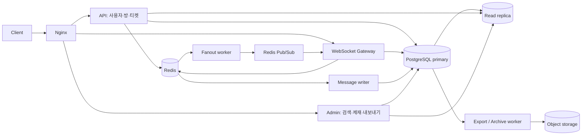

# 아키텍처 개요

이 문서는 현재 저장소의 구현을 설명한다. 10,000 동시 접속과 hot room 10,000 msg/sec는 설계 목표이며, 운영 성능을 인증한 수치가 아니다. 측정 조건과 결과는 [성능 기록](../README.md#성능-측정-기록), 배포 판단은 [운영 준비도](../operations/readiness.md)를 따른다.

## 역할과 데이터 흐름

- API, WebSocket, Admin, Worker는 실행 역할을 분리하고 공통 도메인·영속성 모듈을 사용한다. Worker 내부에서도 writer, fanout, room policy 등의 역할을 설정으로 선택한다.
- Primary는 사용자·멤버십·정책 변경과 canonical 메시지 저장을 담당한다. Read replica는 조회 부하를 분리하며 최신 history 조회에는 lag 기반 primary fallback이 있다.
- Redis Streams의 writer와 fanout consumer group은 독립적이다. DB 저장 완료와 실시간 전달 완료의 선후 관계를 보장하지 않는다.
- Redis Pub/Sub는 일반 publish/subscribe다. Redis Cluster 구성과 sharded Pub/Sub(`SPUBLISH`) 구현은 별개이며, 현재는 후자를 사용하지 않는다.
- Docker 전체 구성은 Redis 3 master + 3 replica, PostgreSQL primary/replica, MinIO를 포함한다. 호스트 Gradle 개발은 standalone Redis를 사용한다. 실행 절차는 [인프라 가이드](../operations/infrastructure.md)에 있다.

## 보장 범위

| 주제 | 현재 계약 | 한계 |
| --- | --- | --- |
| 메시지 수락 | Redis에 원본 envelope와 acceptance 결과를 기록한 뒤 응답 | DB commit 또는 모든 viewer 수신을 의미하지 않음 |
| 재시도 | 방·발신자·clientMessageId로 기존 수락 결과 확인 | 보존 기간과 DLQ 처리 경계를 고려해야 함 |
| 순서 | 메시지별 Redis counter로 roomSeq 발급, 클라이언트 정렬 | sequence 발급과 append는 별개이며 gapless·도착 시간 순서 보장 아님 |
| 전달 | consumer 재처리와 client deduplication | exactly-once 전달 아님 |
| 권한 | 조회·발신 권한 및 전달 batch마다 현재 멤버십 확인 | DB 확인 이후의 동시 변경까지 원자적으로 묶지는 않음 |
| 장애 복구 | pending claim, DLQ, fanout lease, 내구성 있는 제재 재시도 | Pub/Sub 손실, Redis fsync 창, DR 복구는 별도 관리 |

## 상세 문서

- [메시지 수락·전달·순서](messaging.md)
- [인증·WebSocket 티켓·세션 철회](authentication.md)
- [모더레이션·캐시 무효화](moderation.md)
- [저장소·검색·내보내기·아카이브](storage.md)
- [Redis 키와 Cluster 경계](redis-keys.md)

## 설계 선택

현재 스택은 PostgreSQL canonical store와 Redis Streams를 유지한다. Kafka, OpenSearch, Scylla/Cassandra, hot room 전용 Gateway pool은 현재 구현에 포함하지 않는다. 검색 지연이나 쓰기 병목이 튜닝 후에도 목표를 넘는 측정 결과가 있을 때 [후속 과제](../operations/backlog.md)의 전환 조건에 따라 검토한다.
