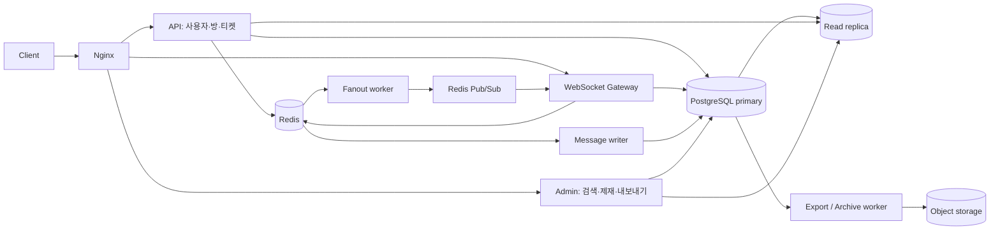

# 아키텍처 개요

이 문서는 현재 저장소의 구현을 설명한다. 10,000 동시 접속과 hot room 10,000 msg/sec는 설계 목표이며, 운영 성능을 인증한 수치가 아니다. 측정 조건과 결과는 [성능 기록](../README.md#성능-측정-기록), 배포 판단은 [운영 준비도](../operations/readiness.md)를 따른다.

## 역할과 데이터 흐름

- API, WebSocket, Admin, Worker는 실행 역할을 분리하고 공통 도메인·영속성 모듈을 사용한다. Worker 내부에서도 writer, fanout, room policy 등의 역할을 설정으로 선택한다.
- Primary는 사용자·멤버십·정책 변경과 canonical 메시지 저장을 담당한다. Read replica는 조회 부하를 분리하며 최신 history 조회에는 lag 기반 primary fallback이 있다.
- Redis Streams의 writer와 fanout consumer group은 독립적이다. DB 저장 완료와 실시간 전달 완료의 선후 관계를 보장하지 않는다.
- Redis Pub/Sub는 일반 publish/subscribe다. Redis Cluster 구성과 sharded Pub/Sub(`SPUBLISH`) 구현은 별개이며, 현재는 후자를 사용하지 않는다.
- Docker 전체 구성은 Redis 3 master + 3 replica, PostgreSQL primary/replica, MinIO를 포함한다. 호스트 Gradle 개발은 standalone Redis를 사용한다. 실행 절차는 [인프라 가이드](../operations/infrastructure.md)에 있다.

## Gradle 모듈 경계

| 모듈 | 현재 책임 | 경계 평가 |
| --- | --- | --- |
| `chat-application` | API와 WebSocket을 묶는 개발용 실행 및 아키텍처 검사 | application 유스케이스 계층이 아니라 composition root |
| `chat-api-application` | API 실행과 JPA·설정 조립 | 실행 역할 분리 |
| `chat-websocket-application` | Gateway 실행과 heartbeat scheduling 활성화 | 실행 역할 분리 |
| `chat-worker-application` | Worker 실행, 역할별 scheduler와 executor 조립 | scheduler가 persistence의 concrete worker를 호출 |
| `chat-admin-application` | 관리자 API 실행과 JPA·설정 조립 | 실행 역할 분리 |
| `chat-runtime-config` | 공통 Spring profile YAML 리소스 | 코드와 외부 의존성 없는 resource JAR |
| `chat-api` | 사용자·방 REST controller와 인증 경계 | core의 서비스 계약 사용 |
| `chat-admin` | 관리자 REST controller와 인증 경계 | core의 서비스 계약 사용 |
| `chat-websocket` | handshake, inbound handler, 연결·구독·전송 큐·heartbeat·Gateway metrics | core 포트 사용; persistence·JPA·Redis 직접 의존 금지 |
| `chat-domain` | JPA 통합 모델과 업무 예외 | core·delivery·infrastructure로 향하는 의존 금지 |
| `chat-core` | 사용자·채팅·관리자 유스케이스, command·조회 결과와 저장소 포트 | concrete adapter·전송 프로토콜·Jackson·Bean Validation 의존 금지 |
| `chat-protocol` | Redis fanout과 Gateway가 공유하는 WebSocket wire DTO·Gateway transport 계약 | 어댑터 사이의 전송 계약; core·Spring·저장소 구현 의존 금지 |
| `chat-persistence` | DB·Redis·S3 adapter와 기술적 Worker | 업무 정책은 core에 두고 stream·파일·lease 조정은 adapter에 유지 |

실행 모듈인 `chat-application`과 내부 계약 모듈인 `chat-core`는 별개다.
`chat-core → chat-domain` 방향만 허용하며 API·관리자·Gateway와 persistence는 core를 사용한다.
회원가입·로그인·방 생성의 HTTP 요청 DTO와 Bean Validation은 `chat-api`가 소유하고,
controller가 core의 `CreateUserCommand`, `LoginCommand`, `CreateChatRoomCommand`로
변환한다. WebSocket 발신도 `SendMessageCommand`를 사용한다. core에는 Jakarta Validation
의존을 허용하지 않는다. 사용자명·표시 이름·비밀번호와 방 이름·정원의 필수 제약은 유스케이스에서
확인하므로 HTTP를 거치지 않는 호출도 저장·암호화·토큰 발급 전에 거부한다. 조회 결과와 paging
계약은 의미가 같은 경우 공유하며 전송 타입을 없애기 위한 기계적인 복제는 하지 않는다.
사용자 생성·로그인·조회·상태 갱신은 `chat-core/user/service`가 수행하고 트랜잭션을 소유한다.
사용자 저장, 로그인 제재 조회, 비밀번호 검증 계약은 `chat-core/user/port`에 있으며
persistence adapter가 JPA/JDBC와 BCrypt·기존 SHA-256 호환을 처리한다. 로그아웃은
Redis 철회 호출 중 DB 트랜잭션을 유지하지 않도록 `NOT_SUPPORTED`를 사용한다.
채팅방·멤버십·history 흐름과 발신 중복 확인·정책 호출 순서도 core가 소유한다.
방 잠금과 JPA 접근은 room port의 adapter가 처리하고, 멤버십 알림은 commit 이후에만
발행하는 `MembershipEvents` 계약을 사용한다. Redis Streams 수락·sequence 발급과
broker 구현은 `MessageAcceptance` 뒤에 남는다.

방 트래픽의 NORMAL·HOT·VERY_HOT·OVERLOAD 판정과 방별 자동 정책 적용 흐름은
core가 소유한다. `RoomHeatClassifier`는 Spring이나 Redis에 의존하지 않는 정책이며,
`RoomHeatSettings`를 통해 기준을 받는다. 기존 `chat.room-policy.*` 키는 persistence에서
바인딩해 정책 설정으로 변환한다. Redis 통계 수집과 JDBC 정책 반영은 core 포트의 adapter다.
정책 신호 공급자는 필수 주입이며 방 하나의 조회·적용 실패는 다음 방의 처리를 막지 않는다.
현재 신호 adapter는 같은 프로세스의 Gateway 큐만 관측한다. 별도 Gateway 프로세스의 큐와
writer/fanout lag를 결합하는 운영 기능은 이 모듈 분리로 구현됐다고 보지 않는다.

메시지 전송의 제재·금칙어·발신 제한 판단도 core가 소유한다. 제재 만료 시각과 scope 우선순위,
금칙어의 대소문자 무시 매칭, 관리자 우회 여부, 제한 결과의 오류 변환은 유스케이스의 책임이다.
조회 adapter는 기존 캐시 레코드를 core 입력으로 변환한다. `RoomAdmissionPolicy`,
`ModerationRuleRecord`, `UserSanctionRecord`의 저장된 캐시 타입은 이동하지 않는다.
Redis adapter는 동일한 key·Lua 원자 연산을 유지하고 허용·제한·장애 결과를 반환한다.
거부 사유와 scope는 core가 정하고 Micrometer adapter가 기존 metric 이름과 tag로 기록한다.
필수 정책 포트는 모두 생성자로 주입하며 저장소나 script 실패를 허용 결과로 바꾸지 않는다.

관리자 검색·정책·모더레이션 유스케이스도 core가 소유한다. 감사 메타데이터와 export 요청의
JSON 직렬화는 adapter가 처리하고, 제재 변경·감사·내구성 있는 무효화/철회 작업 등록은
같은 트랜잭션에 참여한다. 내보내기 상태의 조회·감사는 `AdminExportStatusReader`가
트랜잭션으로 처리한다. 다운로드 URL 생성은 그 트랜잭션이 끝난 뒤 실행하므로 저장소
장애나 서명 처리 중 DB 트랜잭션을 유지하지 않는다. 실행 중인 worker의 로컬 파일 경로는
상태 응답으로 노출하지 않는다.

`chat-protocol`은 Redis Pub/Sub payload와 WebSocket 응답의 동일한 wire schema를
두 어댑터가 공유하기 위한 계약 모듈이다. `CHAT_MESSAGE`, `CHAT_MESSAGE_BATCH`,
`MESSAGE_ACCEPTED`, `ERROR` discriminator와 기존 JSON 필드를 유지한다. core는 이
모듈을 참조하지 않으며 Jackson도 의존하지 않는다. protocol의 방 transport 계약은
서버 간 구독과 JSON 메시지 전달을 위한 것으로 업무 저장소 포트와 구분한다.

WebSocket 연결·로컬 구독·전송 큐·executor·metrics는 `chat-websocket`이 소유한다.
core의 `GatewayMemberships`는 primary DB를 통한 전달 권한 확인, protocol의 `GatewayRoomTransport`는
서버 간 이벤트 수신·방 구독·advisory index 갱신, `SessionControlEvents`는 세션 철회
알림을 담당한다. 저장소 장애는 adapter가 index 갱신 실패로 변환하고 Gateway가 현재
로컬 구독 상태를 기준으로 재시도한다. delivery에는 Redis template이나 repository를 노출하지 않는다.
API·Admin·Worker 프로세스에 `LocalGateway`가 없으면 로컬 알림은 생략하고 Redis 알림은
계속 발행한다. Gateway가 있는 프로세스에서는 commit 이후 로컬 구독도 갱신한다.
전송 executor는 기본 32개 thread와 1,024개 대기 작업으로 제한한다. 대기 작업 하나는
한 세션의 drain 작업이며 개별 메시지 큐의 기본 128개 제한과 별개다. 수용 한도 초과나
executor 종료 후 enqueue는 실패로 반환하고 해당 연결을 1013으로 닫는다. 이 기본값은
처리량 보장이 아니며 실제 연결 수·전송 지연·거부율에 맞춰 `outbound-executor-queue-capacity`를
조정한다. 종료 시 Gateway가 연결·구독·큐를 정리한 뒤 executor 대기 작업을 취소한다.
handshake의 query parameter·fallback 설정은 delivery에서 바인딩하며 기존 설정 키는 유지한다.

WebSocket 부모 세션의 만료·개별 철회·사용자 전체 철회 기준은 core의
`WebSocketTicketSessionPolicy`가 소유한다. Redis 티켓 adapter와 연결 전송 adapter는
같은 정책을 호출하며, Redis 조회와 WebSocket 종료 처리는 각 adapter에 남긴다.

`@Transactional`의 infrastructure 예외는 `PartitionedMessageWriteAdapter.write` 하나다.
이 메서드는 저장소 포트의 한 batch 시도를 원자적으로 보장하며 worker는 성공 이후의 ACK와
재시도 순서를 소유한다. 여러 저장소 변경을 하나의 업무 트랜잭션으로 묶는 요구가 생기면
해당 경계를 core 유스케이스로 옮긴다. 다른 adapter나 controller의 트랜잭션 추가는
아키텍처 검사가 거부하며, controller의 output port 직접 참조도 금지한다.
Fanout의 stream key resolver와 owner lease는 필수 주입한다. 빈 누락을 기본 key 설정이나
lease 검증 생략으로 대체하지 않으며, lease 비활성화는 `owner-lease.enabled=false` 설정으로만 결정한다.

JPA annotation·auditing은 기존 통합 모델의 의도적인 예외다. ORM 제약이 업무 API를
왜곡하면 별도 persistence 모델로 분리한다. `Page`/`Pageable`은 기존 paging·정렬 의미와
응답 호환성을 유지하기 위해 core 계약에 한정해 허용하고 domain 서비스 계약은 제거했다.

현재는 실행 역할 분리가 계층 분리보다 앞서 있다. 모듈 간 순환 의존성이 없다는 사실만으로
layered-clean 구조가 완성됐다고 평가하지 않는다. 유스케이스와 output port의 소유권,
transport DTO, concrete adapter 의존성은 별도로 점검한다.

`chat-application:architectureTest`는 모든 실행 모듈과 코드가 있는 라이브러리를
클래스패스에 포함한다. composition root 누락, 최상위 모듈 package 간 순환,
일반 코드에서 실행 모듈로 향하는 의존성을 검사한다. 이 검사는 실제 Spring context
기동이나 역할별 bean graph 검증을 대체하지 않는다. `chat-runtime-config`는 class가 없는
리소스 모듈이므로 Kotlin 분석과 Kover 집계에서 제외하고 Gradle Kotlin DSL 형식 검사는 유지한다.

실행 JAR 검증에서는 다섯 composition root를 각각 별도 JVM으로 기동·종료한다.
검증용 PostgreSQL 17.9와 standalone Redis, `docker` profile, loopback 임의 HTTP 포트를
사용하고 `spring.jpa.hibernate.ddl-auto=none`으로 자동 DDL을 금지한다. read replica와
object storage는 비활성화하고 Worker의 업무 역할은 비워 둔다. 자동 제재 재시도에 필요한
테이블은 검증 DB에만 준비한다. 이 조건으로 다섯 JAR의 기동·종료를 확인했으며,
Redis Cluster·S3·read replica와 실제 작업 처리는 별도 통합 검증 대상이다.
Gateway Redis adapter는 Boot의 `stringRedisTemplate`과 공존하므로 `redisTemplate`을
명시적으로 선택한다. 동일 타입 빈이 두 개 있는 구성은 별도 Spring 테스트로 고정한다.

## Worker 책임 평가

`MessageWriterWorker`는 stream 수신·재시도·DLQ·ACK를 조정하고 실제 저장은 core의
`MessageWritePort`를 호출한다. `HotRoomFanoutWorker`의 lease 확인·전송·ACK는 Redis
전달 프로토콜의 책임이다. 이 두 흐름에 업무 정책을 추가할 때는 core 유스케이스를 호출한다.
`AdminMessageExportWorker`의 CSV escaping·파일 flush·checkpoint·업로드는 export adapter의
작업이다. export 요청의 권한과 입력 검증, 작업 생성·상태 조회는 core가 담당한다.
`RoomSeqGapAuditWorker`는 DB 진단 결과를 metric으로 노출하는 운영 adapter이며,
방의 heat 판정과 자동 정책 적용은 core의 `RoomPolicyWorker`로 분리한다.
DB lease를 사용하는 캐시 무효화·세션 철회 재시도는 업무 트랜잭션에 작업을 등록한 뒤
외부 처리를 재시도하는 기술적 전달 구현이다. 이런 기술 흐름마다 동일한 포트를 추가해
core에 재배치하지 않는다.

## 보장 범위

| 주제 | 현재 계약 | 한계 |
| --- | --- | --- |
| 메시지 수락 | Redis에 원본 envelope와 acceptance 결과를 기록한 뒤 응답 | DB commit 또는 모든 viewer 수신을 의미하지 않음 |
| 재시도 | 방·발신자·clientMessageId로 기존 수락 결과 확인 | 보존 기간과 DLQ 처리 경계를 고려해야 함 |
| 순서 | 메시지별 Redis counter로 roomSeq 발급, 클라이언트 정렬 | sequence 발급과 append는 별개이며 gapless·도착 시간 순서 보장 아님 |
| 전달 | consumer 재처리와 client deduplication | exactly-once 전달 아님 |
| 권한 | 조회·발신 권한 및 전달 batch마다 현재 멤버십 확인 | DB 확인 이후의 동시 변경까지 원자적으로 묶지는 않음 |
| 장애 복구 | pending claim, DLQ, fanout lease, 내구성 있는 제재 재시도 | Pub/Sub 손실, Redis fsync 창, DR 복구는 별도 관리 |

## 상세 문서

- [메시지 수락·전달·순서](messaging.md)
- [인증·WebSocket 티켓·세션 철회](authentication.md)
- [모더레이션·캐시 무효화](moderation.md)
- [저장소·검색·내보내기·아카이브](storage.md)
- [Redis 키와 Cluster 경계](redis-keys.md)

## 설계 선택

현재 스택은 PostgreSQL canonical store와 Redis Streams를 유지한다. Kafka, OpenSearch, Scylla/Cassandra, hot room 전용 Gateway pool은 현재 구현에 포함하지 않는다. 검색 지연이나 쓰기 병목이 튜닝 후에도 목표를 넘는 측정 결과가 있을 때 [후속 과제](../operations/backlog.md)의 전환 조건에 따라 검토한다.
