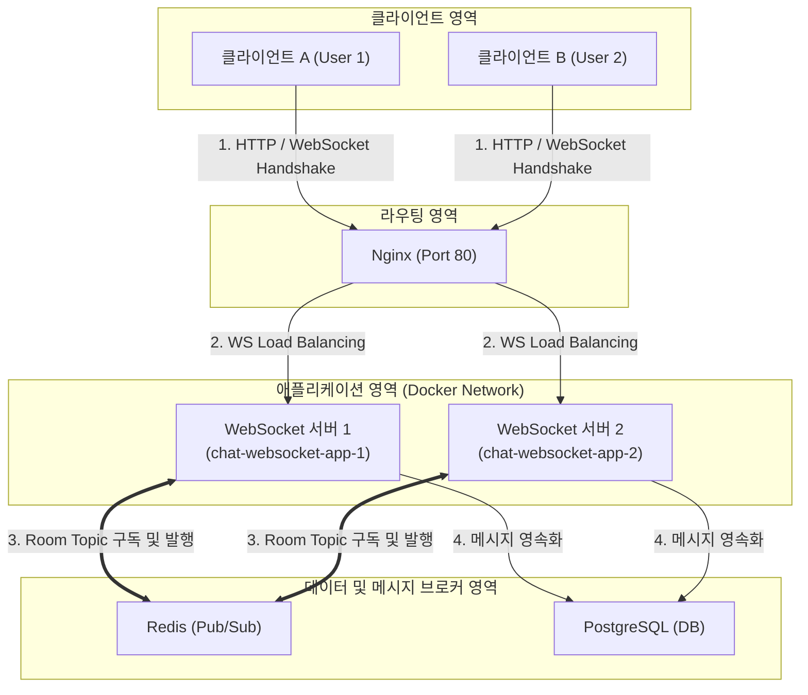
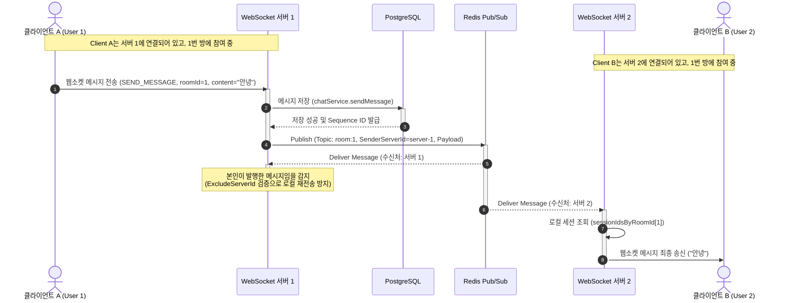

# 분산 채팅 시스템 아키텍처 및 데이터 흐름 개요

이 문서는 사용자가 분산 환경에서 웹소켓을 통해 접속하고, Redis Pub/Sub을 사용하여 실시간으로 메시지를 주고받는 전체 시스템 구조와 상세 데이터 흐름을 다룹니다.

---

## 1. 물리적 아키텍처 구성도

아래 다이어그램은 외부 클라이언트가 Nginx를 거쳐 백엔드 애플리케이션 및 인프라 레이어와 어떻게 연결되는지 보여줍니다.

---

## 2. 실시간 채팅 데이터 흐름 (Sequence Diagram)

사용자 A(서버 1 연결)가 사용자 B(서버 2 연결)에게 메시지를 보낼 때, 메시지가 영속화되고 Redis Pub/Sub을 통해 실시간으로 전달되는 상세 프로세스입니다.

---

## 3. 핵심 흐름 요약

1. **최초 접속 및 동적 구독**:
   - 클라이언트 A와 B가 접속할 때, Nginx는 부하 분산 기준에 따라 클라이언트 A를 `서버 1`로, 클라이언트 B를 `서버 2`로 보냅니다.
   - 각 서버는 클라이언트가 속해 있는 채팅방(예: 1번 방)을 감지하고, 해당 방에 대한 Redis 토픽 구독(`room:1`)을 수행합니다.

2. **메시지 발송 및 저장**:
   - 클라이언트 A가 웹소켓을 통해 메시지를 전송하면, 해당 웹소켓 세션을 소유한 `서버 1`이 이를 수신하여 데이터베이스(PostgreSQL)에 즉시 저장합니다.

3. **이벤트 전파 (Pub/Sub)**:
   - `서버 1`은 데이터베이스 저장이 완료된 후 Redis의 해당 방 토픽(`room:1`)으로 메시지 이벤트를 발행합니다.

4. **수신 및 클라이언트 전달**:
   - Redis는 `room:1` 토픽을 구독 중인 모든 서버(`서버 1`, `서버 2`)에 이벤트를 브로드캐스트합니다.
   - `서버 2`는 이 이벤트를 받아서 로컬 메모리에 있는 1번 방 접속 사용자 목록에서 클라이언트 B의 웹소켓 세션을 찾아 데이터를 최종 전송합니다.
   - `서버 1`은 자기가 발행한 메시지이므로 무시합니다.

---

## 4. 아키텍처 주의사항 및 대안

### 주의사항
> - **메시지 중복 및 순서**: 분산 서버 환경에서 분산 락(Distributed Lock)이나 데이터베이스 시퀀스 넘버링 규칙 없이 병렬로 요청을 처리하면 메시지 순서가 뒤바뀔 위험이 있습니다. 이 시스템은 DB 저장 후 순서 번호를 발급받아 이벤트에 포함시키는 방식으로 순서를 정렬합니다.
> - **인메모리 세션의 한계**: 웹소켓 세션이 서버 로컬 메모리에만 유지되기 때문에 특정 서버가 다운되면 해당 서버에 연결되어 있던 클라이언트의 웹소켓 세션은 끊어집니다. 클라이언트의 자동 재연결(Reconnection) 로직 구현이 필수적입니다.

### 대안
- **메시지 큐(Kafka/RabbitMQ) 도입**:
  - *장점*: Redis Pub/Sub과 달리 영속성을 제공하고 대용량 버퍼링이 가능하므로, 일시적인 웹소켓 서버 다운 시에도 미수신 메시지를 안전하게 재전송할 수 있습니다.
  - *단점*: 인프라 구성 및 유지 관리 비용이 증가합니다.
- **분산 세션 클러스터링**:
  - *장점*: 로컬 메모리에만 세션을 두지 않고 전역 세션 정보를 저장하여 무중단 배포 시 커넥션 유실 충격을 최소화합니다.
  - *단점*: 실시간 웹소켓 세션 자체를 완전히 공유하기는 기술적으로 어렵고 복잡도가 매우 높아집니다.
