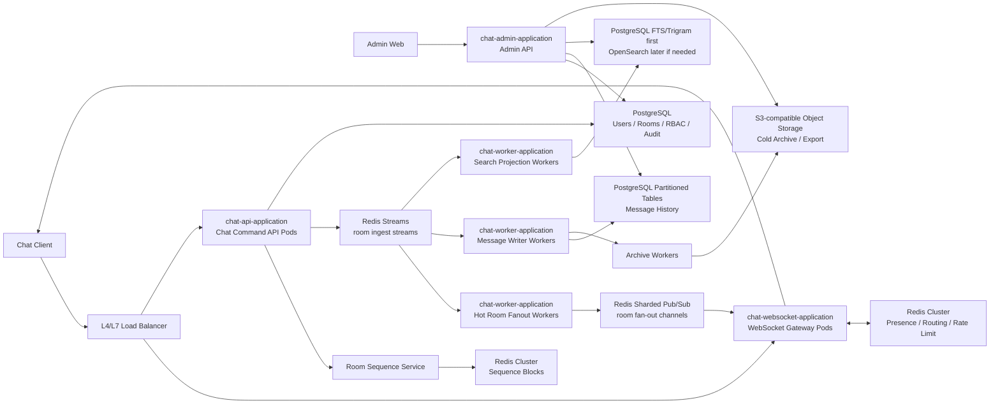

# 고트래픽 클러스터 채팅 서비스 설계서

- 작성일: 2026-06-11
- 전제: Kafka는 사용하지 않는다.

## 1. 문제 이해 / 요구사항 정리

### 조건

- 트위치 채팅처럼 매우 인기 있는 채팅방, 즉 hot room이 존재한다.
- 채팅방별 메시지 속도가 크게 다르며, 일부 방이 전체 트래픽의 대부분을 차지할 수 있다.
- WebSocket 기반 실시간 채팅을 지원한다.
- 여러 애플리케이션 인스턴스가 뜨는 클러스터 환경에서 동작해야 한다.
- 데이터 분산 저장을 고려해야 한다.
- 관리자 페이지가 필요하다.
- 관리자 페이지에서는 채팅 history를 조회할 수 있어야 한다.
- 관리자 페이지에서는 시간대별, 방별 history 검색이 가능해야 한다.
- Kafka는 사용하지 않는다.
- 1차 저장소는 ScyllaDB/Cassandra가 아니라 PostgreSQL 기반 단계적 확장을 우선한다.
- hot room 기준 목표는 방당 동시 접속자 10,000명 이상이다.
- hot room 기준 목표 ingest 처리량은 방당 10,000 messages/sec 이상이다.
- hot room에서 모든 메시지를 모든 접속자에게 실시간 전송하면 이론상 `10,000 msg/sec * 10,000 viewers = 100,000,000 client message deliveries/sec`가 된다.
- 메시지 보관 기간은 100일이다.
- hot room 사용자 화면은 전체 원본 보장을 목표로 하지 않고 bounded live feed로 운영한다. 단, 수락된 메시지의 저장과 관리자/history 조회는 전체 보장한다.
- 로컬 Docker Compose에서 PostgreSQL primary, read replica, 100일 retention partition archive worker를 실행할 수 있어야 한다.
- 현재 저장소는 Kotlin, Spring Boot, Redis Pub/Sub, PostgreSQL, Nginx, React 기반의 분산 채팅 골격을 갖고 있다.

### 목표

- hot room의 메시지 발행, 저장, 전파를 독립적으로 확장한다.
- 단일 PostgreSQL 또는 단일 Redis Pub/Sub 채널이 전체 병목이 되지 않게 한다.
- 실시간 전달과 영속 저장을 분리해 장애 전파를 줄인다.
- 관리자 검색은 사용자 실시간 채팅 경로와 분리한다.
- 방별/시간대별 메시지 조회가 빠르고, 장기 보관과 감사가 가능해야 한다.
- 현재 프로젝트에서 단계적으로 마이그레이션할 수 있는 구조를 제시한다.
- fan-out tier를 수평 확장 가능하게 설계한다.
- PostgreSQL을 먼저 쓰되, 메시지 테이블 파티셔닝, 배치 저장, read replica, 100일 retention archive를 전제로 둔다.

## 2. 라이브 채팅 서비스 조사 근거

공개 문서만 보면 Twitch나 YouTube 같은 라이브 채팅 서비스가 외부 API에 "방별 완전 연속 sequence"를 강하게 노출한다고 보기는 어렵다. 또한 대형 서비스들은 "모든 사용자가 모든 메시지를 무조건 실시간 렌더링"보다 필터, rate limit, moderation, 요약, 재개 토큰 같은 제품/운영 장치를 함께 둔다.

- Twitch IRC 문서는 Twitch 채팅이 IRCv3 message tag 기반이며, tags capability를 통해 메시지별 추가 태그를 받을 수 있다고 설명한다. 또한 ROOMSTATE에는 slow mode, unique message mode 같은 채팅 제어 설정이 존재한다. 참고: [Twitch IRC Concepts](https://dev.twitch.tv/docs/chat/irc/)
- Twitch IRC 문서는 서버가 메시지 순서를 보장하지 않을 수 있고, 너무 빠르게 메시지를 보내면 조용히 drop하거나 연결을 닫을 수 있다고 설명한다. 즉, 공개 챗봇/IRC 관점에서는 gapless ordering이나 무제한 실시간 전송이 계약이 아니다. 참고: [Twitch IRC Concepts](https://dev.twitch.tv/docs/chat/irc/)
- YouTube Live Chat은 사용자가 `Top chat`과 `Live Chat`을 선택할 수 있게 한다. `Top chat`은 스팸 가능성이 있는 메시지 등을 필터링해 읽기 쉽게 만들고, `Live Chat`은 필터링하지 않은 메시지를 보여준다. 또한 신규 시청자에게 AI-generated chat summary를 제공할 수 있다. 참고: [YouTube Help - Learn about Live Chat](https://support.google.com/youtube/answer/15268877?hl=en)
- YouTube LiveChatMessages `list` 문서는 응답의 메시지가 오래된 순서에서 최신 순서로 정렬되며, `nextPageToken`으로 다음 결과를 이어 받는다고 설명한다. 참고: [YouTube LiveChatMessages list](https://developers.google.com/youtube/v3/live/docs/liveChatMessages/list)
- YouTube LiveChatMessages `streamList` 문서는 서버 스트리밍으로 낮은 지연의 메시지를 받고, 끊긴 경우 마지막 `nextPageToken`으로 재개할 수 있다고 설명한다. 각 응답 내부 메시지는 오래된 순서에서 최신 순서로 정렬된다. 참고: [YouTube LiveChatMessages streamList](https://developers.google.com/youtube/v3/live/docs/liveChatMessages/streamList)
- Amazon IVS Chat은 메시지 review handler가 각 `SendMessage` 요청을 허용, 거부, 수정할 수 있고, 허용된 메시지가 방의 사용자에게 전달된다고 설명한다. 서비스 quota도 concurrent chat connections, per-connection messaging rate, per-room SendMessage rate를 별도 한도로 둔다. 참고: [Amazon IVS Chat Message Review Handler](https://docs.aws.amazon.com/ivs/latest/ChatUserGuide/chat-message-review-handler.html), [Amazon IVS Chat Service Quotas](https://docs.aws.amazon.com/ivs/latest/ChatUserGuide/service-quotas.html)

따라서 이 서비스의 방향은 다음처럼 잡는다.

- 사용자 화면: 실시간 메시지는 낮은 지연과 높은 처리량을 우선한다.
- hot room 사용자 화면: bounded live feed를 기본값으로 한다. 기본 정책은 최근 `1,000개`와 최근 `60초`를 동시에 적용하고, 둘 중 하나라도 초과한 메시지는 live window 밖으로 밀어낸다.
- 전체 원본 보장: 수락된 메시지는 모두 PostgreSQL canonical store에 저장하고, history/gap fill/admin/export에서 전체 조회를 보장한다.
- 모든 메시지 실시간 전달: 일반 방 또는 중간 규모 방에서는 가능하면 제공하되, hot room에서는 bounded live feed와 backpressure를 우선한다.
- 메시지 정렬: `roomSeq`와 `createdAt`으로 방별 결정적 정렬을 제공한다.
- sequence 정책: 완전 연속 gapless sequence를 필수 조건으로 두지 않는다. 장애, sequence block 선할당, 재시도 때문에 gap을 허용한다.
- 복구 정책: WebSocket 실시간 전달은 유실/중복 가능성을 인정하고, `messageId` 중복 제거와 `roomSeq` gap fill API로 보정한다.
- 관리자/감사: 수락된 메시지는 모두 PostgreSQL canonical store에 저장하고, 관리자 조회는 canonical store 기준으로 정확성을 확보한다.

결론:

- "모든 메시지 실시간 전달"을 hot room 사용자 화면의 절대 목표로 두지 않는다.
- "수락된 메시지 전체 저장 + bounded live feed + history/gap fill 보정"을 기본 제품 정책으로 채택한다.
- bounded live feed 기본값은 `maxMessages=1000`, `maxAgeSeconds=60`이다. 방별 정책으로 두 값을 모두 override할 수 있다.
- 사용자가 `전체 보기`를 선택하더라도 클라이언트 렌더링은 bounded window를 유지하고, 누락 구간은 history API로 조회하게 한다.

## 3. 현재 구조 요약

현재 프로젝트는 다음 구조를 가진다.

- `chat-application`: 통합 실행 fallback / 로컬 bootstrap
- `chat-api-application`: 사용자 REST API 실행 모듈
- `chat-websocket-application`: WebSocket Gateway 실행 모듈
- `chat-worker-application`: Worker 실행 모듈
- `chat-admin-application`: Admin API 실행 모듈
- `chat-api`: REST API
- `chat-admin`: Admin API
- `chat-domain`: 도메인 모델과 서비스 인터페이스
- `chat-persistence`: JPA, Redis, 서비스 구현
- `chat-websocket`: WebSocket 핸들러
- `client`: React 클라이언트
- `infra`: PostgreSQL, Redis, Nginx 설정

현재 코드는 역할별 실행 모듈을 이미 가진 멀티모듈 구조다. 다만 메시지 처리 내부 구현은 아직 기존 단일 경로에 가깝다. 즉, 배포 단위는 분리되었지만 메시지 계약, Redis Streams ingest, partitioned message store, admin search는 단계적으로 전환해야 한다. 기존 `chat-application`은 실서비스 배포 대상이 아니라 통합 테스트나 로컬 fallback 용도로만 남긴다.

현재 실시간 흐름은 다음에 가깝다.

1. 클라이언트가 WebSocket으로 애플리케이션 인스턴스에 연결한다.
2. 메시지 전송 요청이 들어오면 `ChatServiceImpl.sendMessage()`가 PostgreSQL에 메시지를 저장한다.
3. 로컬 세션에 즉시 전송한다.
4. Redis Pub/Sub으로 다른 인스턴스에 브로드캐스트한다.
5. 각 인스턴스는 로컬 WebSocket 세션으로 메시지를 전달한다.

현재 구조의 장점은 단순하고 이해하기 쉽다는 점이다. 다만 실서비스 고트래픽에서는 다음 지점이 병목이 된다.

- 모든 메시지를 PostgreSQL 단일 테이블에 동기 저장한다.
- Redis Pub/Sub은 내구성이 없으므로 메시지 유실 시 재처리가 어렵다.
- 로컬 fan-out 시 전체 로컬 사용자 세션을 순회하며 DB로 방 멤버 여부를 확인한다.
- hot room 하나가 Redis 채널, DB 인덱스, 애플리케이션 CPU를 집중적으로 사용한다.
- 관리자 검색용 인덱스와 사용자 메시지 조회 저장소가 분리되어 있지 않다.

## 4. 선택한 접근

### 권장 아키텍처

권장안은 `WebSocket Gateway + Hot Room Fanout Workers + Redis Cluster + Redis Streams + PostgreSQL Partitioned Message Store + 관리자 검색 Projection` 구조다.

- 코드베이스는 하나의 멀티모듈 저장소로 유지한다.
- 런타임은 처음부터 역할별 실행 모듈로 분리한다.
- WebSocket Gateway는 연결 유지와 실시간 fan-out만 담당한다.
- Chat Command API는 메시지 검증, rate limit, moderation, sequence 발급을 담당한다.
- Redis Cluster는 presence, room routing, rate limit, 짧은 수명의 fan-out 채널을 담당한다.
- Redis Streams는 Kafka 없이도 메시지 저장 worker, fanout worker, 검색 worker가 재처리 가능한 ingest buffer로 사용한다.
- PostgreSQL은 1차 canonical message store로 사용한다.
- PostgreSQL은 사용자, 방, 권한, 관리자 계정, 설정 같은 관계형 메타데이터도 담당한다.
- OpenSearch는 1차 필수 구성요소가 아니라, PostgreSQL full-text/trigram 검색으로 버티기 어려워지는 시점의 검색 projection store로 둔다.
- S3 호환 object storage는 오래된 메시지의 cold archive와 export 파일 저장소로 사용한다.
- ScyllaDB/Cassandra는 이번 단계에서는 도입하지 않고, PostgreSQL로 감당하기 어려운 규모가 검증될 때의 장기 대안으로만 남긴다.

핵심은 실시간 전파와 메시지 영속 저장과 관리자 검색을 같은 동기 트랜잭션에 넣지 않는 것이다. 사용자는 낮은 지연으로 메시지를 받고, 저장과 검색 인덱싱은 재시도 가능한 비동기 경로에서 처리한다. 단, 수락된 메시지의 원본은 PostgreSQL에 반드시 저장되도록 Redis Streams와 Message Writer Worker를 둔다.

실행 모듈은 처음부터 다음처럼 나눈다.

| 실행 모듈                        | 포함하는 기능                                                                                  | 스케일 기준                                                   |
|------------------------------|------------------------------------------------------------------------------------------|----------------------------------------------------------|
| `chat-api-application`       | REST command API, 사용자/방/메시지 수락 API                                                       | HTTP RPS, CPU, validation latency                        |
| `chat-websocket-application` | WebSocket 연결 유지, local session index, client fan-out                                     | active connections, outbound bytes/sec, send queue depth |
| `chat-worker-application`    | Message Writer Worker, Hot Room Fanout Worker, Search Projection Worker, Archive trigger | Redis Streams lag, DB write latency, fanout lag          |
| `chat-admin-application`     | Admin API, history/search/export, audit action                                           | admin search latency, replica lag, export queue          |

기능 모듈은 `chat-api`와 `chat-admin`을 분리한다. `chat-api`는 사용자/방/메시지 command API만 담당하고, `chat-admin`은 관리자 RBAC, history/search/export, audit controller와 DTO를 담당한다.

기존 `chat-application`은 개발 초기 bootstrap 또는 통합 테스트용 조립 애플리케이션으로만 남기고, 실서비스 배포 대상에서는 제외한다.

## 5. 전체 아키텍처



## 6. 주요 컴포넌트

### 6.1 WebSocket Gateway

역할:

- WebSocket 연결 수립과 유지
- 인증 토큰 검증
- 로컬 세션 관리
- 방 입장/퇴장 시 presence 갱신
- Redis fan-out 채널 구독
- 메시지를 해당 방의 로컬 세션에 전달
- 재연결 시 누락 메시지 gap fill 요청 지원

중요 설계:

- `userId -> sessions`만 저장하지 않고 `roomId -> sessions` 인덱스를 반드시 유지한다.
- 메시지 fan-out 시 전체 로컬 사용자를 순회하지 않는다.
- 각 Gateway는 자신이 실제로 세션을 가진 방만 구독한다.
- 방별 로컬 세션 수, 전송 실패 수, send buffer 크기를 metric으로 노출한다.
- 느린 클라이언트는 서버 메모리를 잠식하지 않도록 bounded queue를 둔다.
- hot room 메시지는 개별 WebSocket frame으로만 보내지 않고 50~100ms 단위 batch frame 전송을 지원한다.
- 클라이언트는 batch 안의 메시지 배열을 `roomSeq` 순서로 처리한다.

현재 `WebSocketSessionManager.sendMessageToLocalRoom()`는 전체 `userSession`을 순회하고, 사용자마다 DB로 멤버 여부를 확인한다. 실서비스에서는 다음 형태로 바꿔야 한다.

```kotlin
// 개념 예시: 실제 구현 코드는 별도 작업에서 작성한다.
roomSessions: ConcurrentHashMap<Long, MutableSet<SessionRef>>
userSessions: ConcurrentHashMap<Long, MutableSet<SessionRef>>
```

메시지 전달 시간은 전체 접속자 수가 아니라 해당 방에 이 Gateway로 붙은 세션 수에 비례해야 한다.

### 6.2 Chat Command API

역할:

- 메시지 입력 검증
- 사용자 인증/인가
- 방 멤버십 확인
- per-user, per-room rate limit
- 금칙어, 스팸, 도배, slow mode 정책 적용
- sequence/message id 발급 요청
- Redis Streams에 메시지 append

권장 정책:

- 메시지 수락 기준을 명확히 둔다.
- 수락된 메시지만 history에 저장한다.
- Redis Streams append가 성공하면 서버는 `MESSAGE_ACCEPTED` ACK를 반환할 수 있다.
- 실시간 fan-out은 API가 직접 모든 Gateway로 발행하지 않고, Hot Room Fanout Worker가 Streams를 읽어 batch 단위로 발행한다.
- 일반 방은 API가 Streams append 후 Pub/Sub 이벤트를 직접 발행해도 되지만, hot room은 fanout worker 경로로 통일한다.
- 클라이언트는 `messageId`, `roomSeq`를 기준으로 중복 제거한다.
- 영속 저장 실패는 Writer Worker에서 재시도한다.
- Redis Streams append 실패 시 실시간 fan-out도 하지 않는다. history에 남지 않는 메시지가 실시간으로만 보이는 상황을 막기 위해서다.

### 6.3 Hot Room Fanout Workers

역할:

- Redis Streams에서 방별 메시지를 읽는다.
- 50~100ms 단위로 메시지를 batch로 묶는다.
- hot room의 fan-out shard 채널 전체에 batch를 발행한다.
- Gateway가 받는 이벤트 수를 `messages/sec`가 아니라 `batches/sec`에 가깝게 줄인다.
- worker 장애 시 Redis Streams pending entry를 재처리한다.

hot room 10,000 msg/sec를 개별 메시지로 발행하면 Redis와 Gateway가 초당 10,000개의 fan-out event를 처리해야 한다. 100ms batch를 사용하면 초당 약 10개의 batch event로 줄어든다. batch 하나에는 약 1,000개의 메시지가 들어간다.

fan-out batch 예시:

```json
{
  "type": "CHAT_MESSAGE_BATCH",
  "roomId": 123,
  "fromSeq": 100001,
  "toSeq": 101000,
  "messages": [
    {
      "messageId": "01J...",
      "roomSeq": 100001,
      "senderId": 456,
      "content": "hello",
      "createdAt": "2026-06-11T12:00:00+09:00"
    }
  ]
}
```

주의할 점:

- batch 전송은 frame 수를 줄일 뿐, 모든 메시지를 모든 클라이언트에 보내는 총 payload 양 자체를 없애지는 않는다.
- 10,000 msg/sec와 10,000 viewers를 모두 full fan-out하면 방 하나만으로도 초당 1억 message delivery가 발생한다.
- 따라서 batch, 압축, backpressure, slow mode, 클라이언트 렌더링 제한이 함께 필요하다.

### 6.4 Room Sequence Service

역할:

- 방별 순서값 `roomSeq`를 발급한다.
- 중복 메시지 방지를 위한 `messageId`를 발급한다.

권장 방식:

- `messageId`: time-sortable ID를 사용한다. 예: ULID, UUIDv7, Snowflake 계열 ID
- `roomSeq`: Redis Cluster의 `INCRBY`로 sequence block을 할당한다.

예시:

1. Gateway/API Pod가 `room:{roomId}:seq`에 대해 `INCRBY 1000`을 호출한다.
2. 반환값이 `5000`이면 해당 Pod는 `4001..5000` 범위의 sequence block을 가진다.
3. 이후 메시지 1000개는 로컬 메모리에서 순차 할당한다.
4. block이 소진되면 다시 Redis에서 block을 받는다.

장점:

- 메시지마다 Redis `INCR`을 호출하지 않는다.
- 방별 순서가 유지된다.
- hot room에서도 sequence 발급 비용을 줄일 수 있다.

주의할 점:

- Pod가 sequence block을 받은 뒤 장애가 나면 일부 sequence가 비게 된다.
- sequence는 반드시 연속일 필요가 없고, 정렬 가능한 단조 증가값이면 충분하다는 정책을 명시해야 한다.

### 6.5 Redis Cluster

역할:

- presence 저장
- Gateway별 구독 방 목록 저장
- room routing 정보 저장
- rate limit counter 저장
- sequence block 발급
- Redis Streams ingest buffer
- Redis Sharded Pub/Sub fan-out

상세 key naming과 hash slot 정책은 [Redis Cluster Key Naming Policy](../../redis_cluster_key_naming.md)를 따른다.

요약 key 예시:

```text
chat:presence:user:<userId> -> set of session ids, TTL
chat:presence:room:<roomId>:gateways -> set of gateway ids, TTL
chat:gateway:<gatewayId>:rooms -> set of room ids, TTL
chat:rate:user:<userId>:sec:<epochSecond> -> count, TTL
chat:rate:room:<roomId>:sec:<epochSecond> -> count, TTL
chat:seq:room:<roomId> -> last allocated room sequence
chat:stream:room:<roomId>:shard:<shardNo> -> Redis Stream
```

기본 원칙은 단일 key 명령과 단일 key Lua script에는 hash tag를 강제하지 않는 것이다. 여러 key를 하나의 Lua script나 transaction으로 묶어야 할 때만 hash tag를 검토한다.

Redis Pub/Sub만 사용하면 내구성이 없다. 따라서 실시간 fan-out에는 Pub/Sub을 쓰되, 저장과 검색 worker는 Redis Streams를 기준으로 처리한다.

### 6.6 Message Writer Workers

역할:

- Redis Streams consumer group으로 메시지를 읽는다.
- 메시지를 canonical message store에 저장한다.
- 실패한 메시지를 재시도한다.
- 일정 횟수 이상 실패하면 dead letter stream에 보낸다.
- 저장 성공 offset을 ack한다.

중요 정책:

- `messageId`를 idempotency key로 사용한다.
- 같은 메시지가 여러 번 처리되어도 저장 결과는 한 번이어야 한다.
- Writer는 방별 또는 room shard별로 수평 확장한다.
- Redis Streams의 pending entry를 주기적으로 claim해 worker 장애를 복구한다.
- PostgreSQL 저장은 JPA `save()` 단건 호출이 아니라 JDBC batch insert, COPY 계열 bulk insert, 또는 R2DBC batch 방식으로 처리한다.
- hot room은 writer를 room shard별로 나누되, 동일 shard 안에서는 `roomSeq` 순서를 유지한다.

### 6.7 PostgreSQL Message Store

1차 권장 저장소는 PostgreSQL이다.

이유:

- 채팅 메시지는 append-heavy time-series 데이터다.
- 방별/시간별 조회가 핵심이다.
- 현재 프로젝트가 이미 PostgreSQL/JPA 기반이라 단계적 전환 비용이 낮다.
- 관리자 RBAC, 감사 로그, 방 메타데이터와 같은 관계형 데이터도 함께 관리하기 쉽다.
- 다만 hot room 때문에 단일 테이블/단일 인덱스/단건 insert로는 버티기 어렵다.

PostgreSQL 확장 전제:

- 메시지 테이블은 시간 range partition과 room/write shard hash partition을 조합한다.
- 메시지 저장은 비동기 writer가 batch insert로 처리한다.
- 최신 조회는 primary 또는 hot read replica를 사용한다.
- 관리자 장기 조회는 read replica 또는 archive table을 사용한다.
- 오래된 파티션은 Object Storage로 archive한 뒤 detach/drop한다.
- ScyllaDB/Cassandra는 1차 도입 대상이 아니라, PostgreSQL partition/read replica/archive로 한계가 확인된 이후의 장기 대안이다.

역할 분리:

- PostgreSQL: 사용자, 방, 멤버십, 권한, 설정, 관리자 감사 로그, 메시지 history
- PostgreSQL FTS/trigram: 초기 관리자 키워드 검색
- OpenSearch: PostgreSQL 검색으로 SLA를 맞추기 어려워질 때 추가하는 검색 projection
- Object Storage: 장기 보관과 대용량 export

### 6.8 PostgreSQL 검색 / OpenSearch

역할:

- 관리자 페이지의 방별/시간대별 메시지 검색
- 사용자별 메시지 검색
- 키워드 검색
- moderation event 검색
- 신고/삭제 이력 검색

초기에는 PostgreSQL partition pruning, B-tree index, GIN full-text index, trigram index로 시작한다. OpenSearch는 canonical store가 아니다. 검색 index가 지연되거나 재생성될 수 있으므로, 도입하더라도 메시지 원본은 PostgreSQL과 Object Storage에 둔다.

### 6.9 Admin API / Admin Web

역할:

- 관리자 로그인과 RBAC
- 방별 history 조회
- 시간대별 history 조회
- 사용자별 메시지 조회
- 키워드 검색
- 메시지 삭제/숨김/복구
- 사용자 제재
- audit log 조회
- 대량 export 요청

관리자 검색 API 예시:

```http
GET /admin/chat-rooms/{roomId}/messages?from=2026-06-11T00:00:00+09:00&to=2026-06-11T01:00:00+09:00&cursor=...&limit=100
GET /admin/messages/search?roomId=123&keyword=hello&from=...&to=...&senderId=456&limit=100
POST /admin/exports/messages
```

관리자 액션은 반드시 audit log를 남긴다.

```text
admin_audit_logs
- id
- admin_user_id
- action_type
- target_type
- target_id
- request_ip
- reason
- before_snapshot
- after_snapshot
- created_at
```

## 7. 메시지 저장 모델

### 7.1 PostgreSQL Partitioned Message Store

PostgreSQL 기준 parent table 예시:

```sql
CREATE TABLE chat_messages (
    message_id text NOT NULL,
    client_message_id text,
    room_id bigint NOT NULL,
    room_seq bigint NOT NULL,
    write_shard smallint NOT NULL DEFAULT 0,
    sender_id bigint NOT NULL,
    message_type varchar(20) NOT NULL,
    content text,
    content_tsv tsvector,
    is_deleted boolean NOT NULL DEFAULT false,
    moderation_flags text[] NOT NULL DEFAULT '{}',
    created_at timestamptz NOT NULL,
    deleted_at timestamptz,
    PRIMARY KEY (created_at, room_id, write_shard, message_id)
) PARTITION BY RANGE (created_at);
```

일별 range partition과 hash subpartition 예시:

```sql
CREATE TABLE chat_messages_20260611
PARTITION OF chat_messages
FOR VALUES FROM ('2026-06-11 00:00:00+09') TO ('2026-06-12 00:00:00+09')
PARTITION BY HASH (room_id, write_shard);

CREATE TABLE chat_messages_20260611_h00
PARTITION OF chat_messages_20260611
FOR VALUES WITH (MODULUS 64, REMAINDER 0);
```

권장 index:

```sql
CREATE UNIQUE INDEX ux_chat_messages_room_seq
ON chat_messages_20260611_h00 (room_id, room_seq);

CREATE INDEX ix_chat_messages_room_time
ON chat_messages_20260611_h00 (room_id, created_at DESC, room_seq DESC);

CREATE INDEX ix_chat_messages_sender_time
ON chat_messages_20260611_h00 (sender_id, created_at DESC);

CREATE INDEX ix_chat_messages_content_tsv
ON chat_messages_20260611_h00 USING gin (content_tsv);
```

설명:

- `message_id`: 전역 중복 제거와 tracing key
- `client_message_id`: 클라이언트 재시도 중복 제거 보조 key
- `room_id`: 방 ID
- `room_seq`: 방 내 결정적 정렬 기준
- `write_shard`: hot room 쓰기 분산용 shard 번호
- `created_at`: range partition pruning 기준
- `content_tsv`: 초기 PostgreSQL full-text 검색용 컬럼

hot room은 write shard 수를 늘린다.

```text
room 100, normal: write_shard = 0
room 200, hot: write_shard = hash(message_id) % 16
room 300, very hot: write_shard = hash(message_id) % 64
```

방별 시간대 조회는 `created_at` range partition을 pruning하고, 해당 room의 write shard를 병렬 조회한 뒤 `roomSeq`로 merge한다.

PostgreSQL-first 전략의 핵심은 다음이다.

- 메시지 insert path에서 JPA entity graph와 lazy loading을 사용하지 않는다.
- writer는 Redis Streams에서 읽은 메시지를 100~1,000건 단위로 batch insert한다.
- 메시지 조회는 JPA repository보다 SQL 전용 query 또는 jOOQ/JdbcTemplate 계열을 우선한다.
- partition 생성, index 생성, archive, detach/drop은 운영 job으로 자동화한다.
- read replica를 관리자 조회와 오래된 history 조회에 적극 사용한다.

### 7.2 Room Shard Config

PostgreSQL에 방별 저장 shard 설정을 둔다.

```sql
room_storage_configs
- room_id
- current_shard_count
- hot_room_policy
- bucket_granularity
- retention_days
- archive_enabled
- updated_at
```

Writer는 `room_storage_configs.current_shard_count`를 읽어 insert 직전 `writeShard = hash(messageId) % currentShardCount`를 계산한다. 설정 row가 없거나 `current_shard_count < 1`이면 1 shard로 fallback한다. `writeShard`는 PostgreSQL 저장 분산용 값이며 Redis Streams의 `streamShard`, WebSocket fan-out의 `fanoutShard`와 독립적으로 유지한다.

이 값은 추후 Redis에 캐시한다. hot room으로 승격되면 shard count를 늘린다. 단, 이미 저장된 과거 bucket의 shard count는 유지하고, 새 bucket부터 변경한다.

### 7.3 PostgreSQL 검색 인덱스

초기 관리자 검색은 PostgreSQL로 처리한다.

권장 방식:

- 정확한 방별/시간대별 조회: `(room_id, created_at DESC, room_seq DESC)` 인덱스
- 사용자별 조회: `(sender_id, created_at DESC)` 인덱스
- 키워드 검색: `tsvector` + GIN index
- 짧은 검색어/부분 문자열 검색: `pg_trgm` + GIN/GiST index
- 삭제 포함 여부/flag 검색: partial index 또는 flag 전용 projection table

OpenSearch를 나중에 도입할 경우 projection 예시:

```json
{
  "message_id": "01J...",
  "room_id": 123,
  "room_seq": 9999,
  "sender_id": 456,
  "sender_name": "alice",
  "content": "hello",
  "message_type": "TEXT",
  "created_at": "2026-06-11T12:00:00+09:00",
  "is_deleted": false,
  "moderation_flags": []
}
```

OpenSearch 도입 기준:

- PostgreSQL full-text 검색이 관리자 검색 p95 1초 목표를 지속적으로 넘는 경우
- 여러 방/긴 시간 범위/복합 조건 검색이 자주 필요한 경우
- 검색 부하가 primary 또는 read replica의 메시지 조회 SLA를 침해하는 경우
- 이때도 검색 결과 상세 확인은 PostgreSQL canonical store에서 재조회해 정합성을 보강한다.

## 8. 메시지 처리 흐름

### 8.1 일반 메시지 전송

1. 클라이언트가 WebSocket 또는 HTTP command endpoint로 메시지를 보낸다.
2. Gateway/API가 인증을 검증한다.
3. 방 멤버십과 채팅 가능 상태를 확인한다.
4. Redis rate limit을 확인한다.
5. Room Sequence Service가 `messageId`, `roomSeq`를 발급한다.
6. 메시지를 Redis Streams에 append한다.
7. append 성공 후 서버는 송신자에게 `MESSAGE_ACCEPTED` ACK를 반환한다.
8. Hot Room Fanout Worker가 Streams에서 메시지를 읽고 50~100ms batch로 묶는다.
9. Fanout Worker가 Redis Sharded Pub/Sub의 fan-out shard 채널에 batch event를 발행한다.
10. 각 Gateway는 `roomId -> sessions` 인덱스로 로컬 세션에 batch를 전송한다.
11. Message Writer Worker가 Streams에서 메시지를 읽어 PostgreSQL partition table에 batch insert한다.
12. Search Worker가 Streams에서 메시지를 읽어 PostgreSQL 검색 projection을 갱신한다. OpenSearch가 도입된 이후에는 OpenSearch에도 색인한다.
13. 클라이언트는 `messageId` 기준으로 중복을 제거하고, `roomSeq` gap이 있으면 history API로 보정한다.

수락 ACK는 "서버가 메시지를 durable ingest queue에 넣었다"는 의미다. 모든 수신자에게 실시간 전달되었거나 검색 인덱스에 반영되었다는 의미가 아니다. 이 의미를 분리해야 클라이언트 재시도, 중복 제거, 장애 복구 정책이 단순해진다.

### 8.2 재연결과 누락 메시지 보정

클라이언트는 방별 마지막 수신 `roomSeq`를 유지한다.

재연결 후:

```http
GET /chat-rooms/{roomId}/messages/gap?afterSeq=12345&limit=200
```

서버는 PostgreSQL canonical store에서 `afterSeq` 이후 메시지를 조회해 내려준다. 이 방식이면 Pub/Sub 유실이나 WebSocket 순간 끊김이 있어도 최종적으로 history를 맞출 수 있다.

### 8.3 관리자 방별/시간대별 검색

방별 시간 조회:

1. Admin API가 관리자 권한을 확인한다.
2. `roomId`, `from`, `to`로 bucket 범위를 계산한다.
3. 짧은 시간 범위의 정확 조회는 PostgreSQL partition table을 직접 조회한다.
4. 키워드가 있으면 초기에는 PostgreSQL FTS/trigram index를 조회한다.
5. OpenSearch 도입 이후에는 OpenSearch 결과의 `messageId` 목록을 기준으로 PostgreSQL canonical store에서 원본을 재조회한다.
6. 관리자 화면에 pagination cursor와 함께 반환한다. Admin keyword/global search와 admin room history cursor는 `createdAt + roomSeq + messageId`를 Base64URL로 감싼 opaque cursor를 사용하고, 클라이언트는 값을 해석하지 않고 그대로 재전송한다. 일반 사용자 room history도 `cursorToken` 기반 opaque cursor를 지원하며, numeric cursor는 public client migration 이후 `2 releases or 30 days` 중 더 긴 기간 동안 호환 유지한다.

대량 export:

1. Admin API가 export job을 만든다.
2. Export Worker가 PostgreSQL canonical store에서 `exportChunkSize` 단위로 데이터를 읽는다. 기본값은 1,000건이며, 전체 export cap은 10,000건이다.
3. Worker는 각 chunk를 CSV에 기록한 뒤 `cursor_token`, `exported_rows`, `output_uri` checkpoint를 저장한다.
4. 실패한 job이 운영자 또는 retry 정책으로 다시 `PENDING`이 되면, Worker는 checkpoint cursor와 기존 output 파일에서 이어 쓴다.
5. CSV 또는 Parquet 파일을 Object Storage에 저장한다.
6. 관리자에게 만료 시간이 있는 다운로드 URL을 제공한다.

> Resume checkpoint는 chunk 단위 best-effort 보장이다. 파일 append 성공 후 DB checkpoint 저장 전에 프로세스가 죽는 매우 짧은 구간에서는 재시도 시 마지막 chunk가 중복될 수 있다. 이 경우 운영자는 해당 job을 재생성하거나 output 파일을 정리한 뒤 재시도한다.

## 9. Hot Room 대응 전략

### 9.1 목표 수치와 산술

1차 목표:

- hot room 동시 접속자: 10,000명 이상
- hot room ingest: 10,000 messages/sec 이상
- 수락된 메시지 저장: 100%
- 관리자 history 조회: 수락된 메시지 기준 전체 조회 가능
- 실시간 사용자 화면: batch fan-out, backpressure, gap fill을 전제로 낮은 지연 제공

full fan-out 산술:

```text
10,000 messages/sec * 10,000 viewers
= 100,000,000 client message deliveries/sec
```

이 수치는 방 하나만으로도 매우 크다. 따라서 설계 목표를 두 층으로 나눈다.

- Ingest/persistence 목표: 10,000 msg/sec 이상을 모두 수락하고 저장한다.
- Realtime delivery 목표: Gateway 수평 확장, batch frame, 압축, backpressure로 최대한 전달하되, 느린 클라이언트는 gap fill로 복구한다.

### 9.2 Fan-out 최적화

hot room에서는 메시지 한 건이 수만 명에게 전달될 수 있다. 이때 비용은 메시지 수보다 `메시지 수 * 구독자 수`에 가깝다.

대응:

- Gateway local index를 `roomId -> sessions`로 유지한다.
- Gateway는 실제 구독자가 있는 방만 Redis channel을 구독한다.
- Redis channel은 room 단위에서 room bucket 단위로 확장 가능하게 둔다.
- hot room은 `roomId + fanoutShard`로 채널을 나누고, Gateway는 자신에게 배정된 fan-out shard 채널만 구독한다.
- Hot Room Fanout Worker는 hot room 메시지를 모든 fan-out shard 채널에 batch로 복제 발행한다.
- Gateway는 batch를 받아 로컬 세션으로 다시 broadcast한다.
- 느린 클라이언트는 최신 메시지 우선 정책 또는 연결 종료 정책을 적용한다.

fan-out channel 예시:

```text
fanout:room:{roomId}:shard:{0..N-1}
```

이 방식은 발행 비용이 `O(fanoutShardCount)`로 늘지만, 하나의 Redis channel 또는 Redis node에 모든 Gateway subscriber가 몰리는 문제를 줄인다. 일반 방은 shard 수를 1로 두고, hot room만 shard 수를 늘린다.

예시 배치:

```text
hot room ingest: 10,000 msg/sec
batch interval: 100ms
messages per batch: 약 1,000개
fanout shard: 16개
Redis publish rate: 약 10 batches/sec * 16 = 160 publish/sec
```

이 구조는 Redis/Gateway control-plane event 수를 줄인다. 단, 모든 클라이언트가 모든 메시지를 받는다면 payload 총량은 여전히 크다.

### 9.3 Gateway 수평 확장 모델

10,000 viewers를 40개 Gateway Pod에 분산하면 Pod당 약 250 연결이다. 연결 수만 보면 낮지만, 10,000 msg/sec full fan-out이면 Pod당 약 `10,000 * 250 = 2,500,000 message deliveries/sec`가 된다.

따라서 Gateway scaling 기준은 연결 수가 아니라 다음 metric이어야 한다.

- outbound payload bytes/sec
- batch frames/sec
- local delivery count/sec
- send queue depth
- WebSocket write latency p95/p99
- slow client disconnect count
- event loop 또는 worker pool saturation

권장:

- hot room Gateway pool을 일반 방 Gateway pool과 분리한다.
- hot room은 room-aware routing으로 전용 Gateway group에 배치한다.
- Gateway는 메시지를 JSON 단건 문자열이 아니라 batch JSON 또는 binary codec으로 전송할 수 있게 한다.
- gzip/permessage-deflate는 CPU 사용량을 함께 보면서 적용한다.
- 클라이언트 렌더링은 초당 표시 가능한 메시지 수를 제한하고, 내부 buffer는 최신 우선으로 유지한다.

### 9.4 Write Sharding

hot room 메시지는 같은 partition에 몰리면 안 된다.

대응:

- room/time bucket/shard를 partition key로 사용한다.
- hot room은 shard 수를 동적으로 늘린다.
- shard 변경은 새 time bucket부터 적용해 조회 복잡도를 제한한다.

### 9.5 Rate Limit과 Slow Mode

무제한 채팅을 허용하면 인프라 확장만으로 해결되지 않는다. 서비스 정책도 필요하다.

권장 정책:

- 사용자별 초당 메시지 제한
- 방별 전체 초당 메시지 제한
- 신규 계정/비인증 계정 제한
- hot room slow mode
- 동일 메시지 반복 제한
- 운영자/스트리머/moderator 우선권
- 서버 혼잡 시 일반 사용자의 메시지 수락률 제한

### 9.6 QoS 정책

실시간 채팅은 저장 정합성과 실시간 체감 품질의 균형이 필요하다.

권장 QoS:

- 수락된 메시지는 반드시 history에 남긴다.
- 일반 방 실시간 전달은 at-least-once에 가깝게 처리하고, 클라이언트가 중복 제거한다.
- hot room 사용자 화면은 bounded live feed로 운영한다.
- hot room 클라이언트는 기본적으로 최근 `1,000개` 메시지와 최근 `60초` window를 동시에 적용한다.
- 메시지 수 제한과 시간 제한은 OR 조건으로 적용한다. 즉, `messageCount > maxMessages`이거나 `now - message.createdAt > maxAgeSeconds`이면 live window에서 제거한다.
- 방별 정책은 `maxMessages`, `maxAgeSeconds`, `batchIntervalMs`, `maxBatchSize`, `slowModeSeconds`, `roomRateLimitPerSecond`를 함께 가진다.
- bounded live feed 정책 override 권한은 admin만 가진다. 방 owner와 moderator는 조회만 가능하고 직접 변경할 수 없다.
- very hot room은 메시지 발행량이 임계치를 넘으면 자동 downgrade 정책을 적용할 수 있다.
- 자동 downgrade는 live feed window를 줄이는 표시 정책과 방별 rate limit/slow mode를 강화하는 수락 정책을 분리해서 적용한다.
- hot room Gateway는 slow client의 밀린 메시지를 무한 queueing하지 않고, 최신 batch 우선으로 전환하거나 연결을 재수립하게 한다.
- 화면에서 빠진 메시지는 누락이 아니라 live feed window 밖으로 밀려난 것으로 본다. 전체 메시지는 history/gap fill/admin/export 경로에서 보장한다.
- WebSocket 전달 실패는 history gap fill로 복구한다.
- 너무 느린 클라이언트에는 오래된 pending 메시지를 버리고 최신 메시지부터 보낸다.
- 관리자와 moderator는 가능한 한 전체 메시지를 조회할 수 있어야 한다.

기본 정책:

| 등급         | 기준                                                   | live feed                              | 수락 정책                                |
|------------|------------------------------------------------------|----------------------------------------|--------------------------------------|
| `NORMAL`   | `roomMessagesPerSecond < 1,000`                      | `maxMessages=1000`, `maxAgeSeconds=60` | 기본 사용자/방 rate limit                  |
| `HOT`      | `1,000 <= roomMessagesPerSecond < 5,000`             | `maxMessages=1000`, `maxAgeSeconds=60` | slow mode 권장, 신규/비인증 계정 제한 강화        |
| `VERY_HOT` | `roomMessagesPerSecond >= 5,000` 또는 1분 p95가 5,000 이상 | `maxMessages=500`, `maxAgeSeconds=30`  | 방별 rate limit 강화, slow mode 자동 적용 가능 |
| `OVERLOAD` | writer lag, fanout lag, Gateway send queue가 임계치 초과   | `maxMessages=300`, `maxAgeSeconds=15`  | 일반 사용자 수락률 제한, moderator/streamer 우선 |

정책 적용 규칙:

- 등급 판정은 최근 10초 EWMA와 최근 1분 p95를 함께 본다.
- 상향 전환은 빠르게 한다. 예: 임계치 2회 연속 초과 시 즉시 `VERY_HOT`.
- 하향 전환은 천천히 한다. 예: 5분 동안 안정적으로 임계치 미만일 때 한 단계씩 완화.
- live feed downgrade는 클라이언트 표시량을 줄이는 정책이며, 수락된 메시지 저장률 100% 목표를 바꾸지 않는다.
- rate limit/slow mode는 메시지 수락량을 제어하는 정책이며, abuse와 overload를 막기 위해 admin 정책에 따라 자동 적용할 수 있다.

## 10. 클러스터 운영 설계

### 10.1 Kubernetes 배치

권장 workload:

- `chat-api-application`: REST/command API
- `chat-websocket-application`: WebSocket 연결 유지와 local fan-out
- `chat-worker-application`: Redis Streams consumer, message writer, hot room fanout worker, search projection worker, archive trigger
- `chat-admin-application`: admin API, history/search/export, audit action
- `client`/`admin-web`: 정적 프론트엔드 또는 별도 배포

초기 replica 예시:

| workload                     | 초기 replicas | HPA 기준                                                   |
|------------------------------|-------------|----------------------------------------------------------|
| `chat-api-application`       | 2~3         | HTTP RPS, CPU, p95 latency                               |
| `chat-websocket-application` | 3~10        | active connections, outbound bytes/sec, send queue depth |
| `chat-worker-application`    | 2~6         | Redis Streams lag, fanout lag, DB write latency          |
| `chat-admin-application`     | 1~2         | admin search latency, replica lag, export queue depth    |

`chat-worker-application`은 처음에는 하나의 실행 모듈로 시작하되, 내부 worker role을 설정으로 분리한다.

```text
WORKER_ROLES=message-writer,fanout,search-projection,archive
```

운영 중 특정 role만 병목이 되면 같은 실행 모듈을 role별 Deployment로 나눠 띄운다.

WebSocket Gateway는 HPA 기준을 CPU만으로 잡으면 부족하다.

권장 scaling metric:

- active WebSocket connections
- outbound messages/sec
- event loop 또는 worker queue lag
- send queue depth
- Redis subscription count
- p95/p99 send latency

### 10.2 로드 밸런싱

- WebSocket은 연결이 생성되면 해당 Gateway에 오래 머문다.
- sticky session은 필수는 아니지만, 재연결 빈도를 줄이기 위해 사용할 수 있다.
- 더 중요한 것은 Gateway가 stateless하게 복구 가능해야 한다는 점이다.
- presence는 Redis TTL 기반으로 갱신한다.
- Gateway 장애 시 TTL 만료 또는 heartbeat 누락으로 routing에서 제거한다.

### 10.3 장애 복구

장애별 처리:

- Gateway 장애: 클라이언트 재연결, gap fill
- API Pod 장애: 클라이언트 재시도, idempotency key로 중복 방지
- Writer 장애: Redis Streams pending entry claim 후 재처리
- PostgreSQL primary 장애: managed failover 또는 standby promotion으로 복구, 수락 경로는 일시 제한
- PostgreSQL read replica 장애: 관리자 조회를 다른 replica 또는 primary fallback으로 전환
- OpenSearch 장애: 도입한 경우 search lag 증가, PostgreSQL canonical store 저장은 계속 진행
- Redis 장애: Sentinel/Cluster 구성, Streams AOF 설정, Redis 장애 시 메시지 수락 제한

### 10.4 로컬 Docker Compose 인프라 구성

현재 로컬 Compose는 PostgreSQL-first 확장 경로를 검증할 수 있도록 다음 서비스를 포함한다.

| 서비스                          | 역할                                                                    | 주요 파일                                                                                                                             |
|------------------------------|-----------------------------------------------------------------------|-----------------------------------------------------------------------------------------------------------------------------------|
| `postgres`                   | write primary, WAL streaming source, partitioned message schema owner | `docker-compose.yml`, `infra/postgres/init-db.sql`, `infra/postgres/primary/pg_hba.conf`, `infra/postgres/message-partitions.sql` |
| `postgres-primary-setup`     | 기존 로컬 볼륨에서도 replication role과 partitioned schema를 보장하는 one-shot setup | `infra/postgres/primary/configure-primary.sh`                                                                                     |
| `postgres-replica`           | `pg_basebackup` 기반 streaming read replica                             | `infra/postgres/replica/bootstrap-replica.sh`                                                                                     |
| `postgres-partition-archive` | 100일보다 오래된 `chat_messages_YYYYMMDD` 파티션을 CSV로 archive하는 worker        | `infra/postgres/archive/archive-partitions.sh`                                                                                    |

기본 포트:

```text
primary: localhost:5432
replica: localhost:5433
```

보관 정책:

```text
CHAT_MESSAGE_RETENTION_DAYS=100
CHAT_PARTITION_ARCHIVE_DROP_AFTER_COPY=false
CHAT_PARTITION_ARCHIVE_INTERVAL_SECONDS=86400
```

`CHAT_PARTITION_ARCHIVE_DROP_AFTER_COPY=false`가 기본값인 이유는 로컬 개발에서 데이터를 즉시 삭제하지 않고 archive 파일 생성만 검증하기 위해서다. 운영에 가까운 테스트에서는 `true`로 바꿔 archive 성공 후 partition을 detach/drop한다.

검증 명령:

```bash
docker compose up -d postgres postgres-primary-setup postgres-replica postgres-partition-archive

docker compose exec -T postgres \
  psql -U chatuser -d chatdb \
  -Atc "select usename,state,sync_state from pg_stat_replication;"

docker compose exec -T postgres-replica \
  psql -U chatuser -d chatdb \
  -Atc "select pg_is_in_recovery(), to_regclass('public.chat_messages') is not null;"

docker compose run --rm \
  -e CHAT_PARTITION_ARCHIVE_RUN_ONCE=true \
  postgres-partition-archive
```

기대 결과:

- `pg_stat_replication`에 `chat_replicator|streaming|async`가 보인다.
- replica에서 `pg_is_in_recovery()`가 `true`다.
- `chat_messages`, `chat_messages_default`, `room_storage_configs`가 생성되어 있다.
- 오래된 파티션이 없으면 archive worker는 `No partitions are older than retention window.`로 정상 종료한다.

현재 한계:

- 애플리케이션은 아직 `DB_READ_HOST=postgres-replica`를 사용하지 않는다. read/write datasource 분리는 Phase 4 구현 대상이다.
- 현재 JPA `messages` 테이블과 신규 `chat_messages` partitioned table은 병행 상태다. 신규 table은 Message Writer Worker phase를 위한 준비물이다.
- archive worker는 로컬 검증용 CSV archive와 checksum metadata 저장을 수행한다. 운영에서는 S3 호환 object storage 업로드 경로를 추가한다.

## 11. 관리자 페이지 설계

### 11.1 메뉴

- 대시보드
  - 전체 메시지/sec
  - 방별 메시지/sec
  - room heat 등급: `NORMAL`, `HOT`, `VERY_HOT`, `OVERLOAD`
  - bounded live feed 현재 정책: `maxMessages`, `maxAgeSeconds`
  - 방별 rate limit / slow mode 상태
  - hot room 순위
  - WebSocket 접속자 수
  - 저장 worker lag
  - 검색 index lag
- 채팅방 관리
  - 방 검색
  - 방 상태 변경
  - slow mode 설정
- rate limit 설정
  - bounded live feed 설정 조회
  - admin-only bounded live feed override
  - heat 등급 자동 downgrade 이력
- 메시지 히스토리
  - 방별 조회
  - 시간대별 조회
  - 사용자별 조회
  - 키워드 검색
  - 삭제/숨김/복구
- 사용자 제재
  - mute
  - ban
  - shadow ban
  - 제재 만료 관리
- 감사 로그
  - 관리자 액션 조회
  - export 이력 조회

### 11.2 메시지 히스토리 화면

필터:

- roomId 또는 room name
- from/to 시간
- senderId 또는 username
- keyword
- message type
- deleted 포함 여부
- moderation flag
- room heat 등급
- bounded live feed 정책
- 검색 대상 shard/partition

목록 컬럼:

- timestamp
- room
- roomSeq
- sender
- content
- flags
- deleted 여부
- admin action
- search latency
- source: primary/read-replica/search projection

상세 패널:

- 원문 메시지
- 주변 메시지 보기
- sender profile
- 신고 이력
- 삭제/숨김 사유
- audit trail
- 해당 시점의 room heat 등급
- 해당 시점의 bounded live feed 정책
- 검색 쿼리 실행 계획 요약

운영 UI 표출:

| 영역           | 표시 항목                                                  | 목적                                      |
|--------------|--------------------------------------------------------|-----------------------------------------|
| 방 상태 배지      | `NORMAL`, `HOT`, `VERY_HOT`, `OVERLOAD`                | 현재 방이 왜 downgrade/rate limit 상태인지 즉시 파악 |
| Live feed 정책 | `1000/60s`, `500/30s`, `300/15s`                       | 사용자 화면에 보이는 메시지 window 확인               |
| 수락 정책        | `roomRateLimitPerSecond`, `slowModeSeconds`, 신규/비인증 제한 | 메시지 발행량 제어 상태 확인                        |
| 검색 상태        | 조회 건수, 검색 latency, replica lag, partition count        | 관리자 검색 성능과 정합성 확인                       |
| 자동 변경 이력     | heat 등급 변경, downgrade 적용/해제, admin override            | 장애 분석과 감사                               |

관리자 검색 테스트 데이터:

- 1차 목표 데이터 규모는 `10,000,000 messages`다.
- 테스트 데이터는 hot room 1개에만 몰지 않고, normal/hot/very hot room을 섞어 partition pruning과 방별 조회 성능을 함께 본다.
- 기본 분포는 `normal 60%`, `hot 30%`, `very hot 10%`로 시작한다.
- 관리자 검색 UI는 검색 결과뿐 아니라 `검색 대상 partition 수`, `검색 latency`, `read replica lag`, `검색 결과 cursor`, `쿼리 조건 요약`을 함께 표출한다.

### 11.3 권한

권장 RBAC:

- `SUPER_ADMIN`: 모든 권한
- `TRUST_AND_SAFETY_ADMIN`: 메시지/사용자 제재 권한
- `ROOM_MODERATOR`: 지정 방 관리 권한
- `READ_ONLY_ADMIN`: 조회만 가능
- `EXPORT_ADMIN`: 대량 export 가능

민감 작업은 reason 입력을 강제한다.

## 12. API 설계 초안

### 12.1 사용자 채팅 API

```http
GET /chat-rooms/{roomId}/messages?beforeSeq=10000&limit=50
GET /chat-rooms/{roomId}/messages?afterSeq=10000&limit=200
GET /chat-rooms/{roomId}/messages/latest?limit=50
POST /chat-rooms/{roomId}/messages
```

WebSocket client event:

```json
{
  "type": "SEND_MESSAGE",
  "clientMessageId": "client-generated-id",
  "chatRoomId": 123,
  "messageType": "TEXT",
  "content": "hello"
}
```

WebSocket accepted ACK:

```json
{
  "type": "MESSAGE_ACCEPTED",
  "clientMessageId": "client-generated-id",
  "messageId": "01J...",
  "chatRoomId": 123,
  "roomSeq": 10001,
  "acceptedAt": "2026-06-11T12:00:00+09:00"
}
```

WebSocket server single message event:

```json
{
  "type": "CHAT_MESSAGE",
  "messageId": "01J...",
  "clientMessageId": "client-generated-id",
  "chatRoomId": 123,
  "roomSeq": 10001,
  "senderId": 456,
  "senderName": "alice",
  "content": "hello",
  "createdAt": "2026-06-11T12:00:00+09:00"
}
```

WebSocket server batch event:

```json
{
  "type": "CHAT_MESSAGE_BATCH",
  "chatRoomId": 123,
  "fromSeq": 10001,
  "toSeq": 11000,
  "messages": [
    {
      "messageId": "01J...",
      "roomSeq": 10001,
      "senderId": 456,
      "senderName": "alice",
      "content": "hello",
      "createdAt": "2026-06-11T12:00:00+09:00"
    }
  ]
}
```

### 12.2 관리자 API

```http
GET /admin/chat-rooms
GET /admin/chat-rooms/{roomId}/messages
GET /admin/messages/search
GET /admin/users/{userId}/messages
POST /admin/messages/{messageId}/hide
POST /admin/messages/{messageId}/restore
POST /admin/users/{userId}/sanctions
GET /admin/audit-logs
POST /admin/exports/messages
GET /admin/exports/{exportId}
```

## 13. 정합성 모델

권장 정합성:

- 메시지 수락: Redis Streams append 성공 기준
- 실시간 전달: at-least-once 가능성, 클라이언트 중복 제거
- 영속 저장: eventually consistent, worker 재시도로 보장
- PostgreSQL canonical store: 수락된 메시지 원본 저장 기준
- 검색 projection: eventually consistent
- 관리자 정확 조회: PostgreSQL canonical store 기준
- 관리자 키워드 검색: PostgreSQL FTS/trigram 우선, OpenSearch 도입 시 OpenSearch 결과 + PostgreSQL 재조회

메시지가 클라이언트에 보였는데 history에 없는 상태를 줄이기 위해, fan-out은 Streams append 성공 후에만 수행한다.

Redis Streams를 durable ingest queue로 쓰려면 AOF, replication, failover 정책을 명확히 잡아야 한다. 예를 들어 `appendfsync everysec`는 성능이 좋지만 장애 시 최대 약 1초 분량의 손실 가능성을 받아들이는 설정이고, `appendfsync always`는 손실 가능성을 낮추지만 쓰기 처리량과 지연 시간이 나빠진다.

## 14. 보안 / 운영 정책

필수 항목:

- WebSocket 연결 시 JWT 또는 session token 검증
- 사용자 ID query parameter 신뢰 금지
- 관리자 API 별도 인증과 RBAC
- 관리자 audit log 불변 저장
- rate limit과 abuse detection
- 메시지 삭제는 hard delete보다 tombstone 권장
- 개인정보 마스킹과 export 권한 분리
- Object Storage export URL 만료 시간 설정
- PostgreSQL read replica와 검색 projection 접근 권한 분리
- OpenSearch를 도입하는 경우 관리자 인덱스 접근 제한

현재 프로젝트의 `ws://.../ws/chat?userId=1` 방식은 실서비스에서는 부적합하다. userId는 토큰에서 추출해야 하며, query parameter는 인증 주체로 신뢰하면 안 된다.

## 15. 관측 가능성

필수 metric:

상세 dashboard, alert, cardinality 정책은 [Observability Metrics](../../observability_metrics.md)를 따른다.

- active connections
- messages accepted/sec
- messages rejected/sec
- room messages/sec
- hot room top N
- Gateway send latency p50/p95/p99
- Gateway send queue depth
- Redis Streams lag
- Writer success/failure count
- fanout batch size
- fanout worker lag
- PostgreSQL partition write latency
- PostgreSQL replica lag
- Search projection lag
- Admin search latency
- WebSocket reconnect rate

필수 log/tracing:

- `messageId` 기반 end-to-end trace
- `roomId`, `roomSeq`, `gatewayId`, `workerId`
- 관리자 action audit log
- rate limit reject reason
- moderation reject reason

## 16. 복잡도

기호:

- `M`: 초당 수락 메시지 수
- `R`: 방 수
- `U`: 전체 접속 사용자 수
- `S_r`: 특정 방 `r`의 접속 세션 수
- `G_r`: 특정 방 `r`을 구독 중인 Gateway 수
- `B_r`: 특정 방 `r`의 저장 shard 수
- `F_r`: 특정 방 `r`의 fan-out shard 수
- `Q`: batch 하나에 포함된 메시지 수
- `K`: 조회 결과 개수

### 메시지 전송

- 단건 기준 시간 복잡도: `O(1 + F_r + S_local_room)`
  - sequence 발급, rate limit, Streams append는 평균 `O(1)`이다.
  - Redis fan-out 발행은 fan-out shard 수 `F_r`에 비례한다.
  - 각 Gateway의 실제 전송은 로컬 방 세션 수 `S_local_room`에 비례한다.
- batch 기준 event 처리 복잡도: `O(1 + F_r + S_local_room)`
  - 단, batch 하나가 `Q`개 메시지를 담으므로 메시지당 control-plane 비용은 `O((1 + F_r + S_local_room) / Q)`로 낮아진다.
- 공간 복잡도: `O(U + activeRoomSubscriptions)`
  - Gateway는 활성 세션과 방별 세션 인덱스를 메모리에 유지한다.

현재 구조처럼 전체 로컬 사용자를 순회하면 fan-out은 `O(U_local)`이 된다. 권장 구조에서는 해당 방의 로컬 구독자만 순회하므로 `O(S_local_room)`으로 줄어든다.

### 메시지 저장

- 시간 복잡도: 메시지 1건 저장 평균 `O(1)`
- batch insert 시간 복잡도: `O(batchSize)`
- 공간 복잡도: `O(totalMessages)`
- shard merge 조회 시간 복잡도: `O(B_r * pageRead + K log B_r)`
  - 여러 shard에서 읽은 결과를 `roomSeq` 기준으로 merge한다.

### 관리자 검색

- 방별/시간대 정확 조회 시간 복잡도: `O(B_r * pageRead + K log B_r)`
- PostgreSQL FTS/trigram 키워드 검색 시간 복잡도: 인덱스 선택도에 따라 달라지며, 일반적으로 `O(log N + K)`에 가깝게 목표를 잡는다.
- OpenSearch 도입 후 키워드 검색 시간 복잡도: 보통 `O(log N + K)`에 가깝지만, analyzer와 filter cardinality에 따라 달라진다.
- 공간 복잡도: `O(totalMessages + searchIndexSize + archiveSize)`

## 17. 주의사항

> - Kafka를 쓰지 않는 대신 Redis Streams 또는 NATS JetStream 같은 대체 durable queue의 운영 책임이 커진다.
> - Redis Pub/Sub만으로는 메시지 유실 복구가 어렵다. 실시간 fan-out과 durable ingest를 분리해야 한다.
> - hot room은 인프라 확장만으로 해결되지 않는다. slow mode, rate limit, moderation, QoS 정책이 같이 필요하다.
> - 방별 strict total ordering을 너무 강하게 요구하면 hot room 처리량이 떨어질 수 있다. `roomSeq`는 단조 증가하되 일부 gap을 허용하는 편이 현실적이다.
> - PostgreSQL-first 전략은 운영 단순성이 장점이지만, 방당 10,000 msg/sec 이상을 장기간 저장하려면 파티션 관리, batch insert, read replica, archive 자동화가 필수다.
> - OpenSearch를 도입하더라도 검색 projection이지 원본 저장소가 아니다. 관리자 감사나 법적 보관 목적은 PostgreSQL/Object Storage 기준으로 설계해야 한다.
> - 관리자 export는 대량 조회로 운영 DB를 압박할 수 있으므로 반드시 비동기 job으로 처리해야 한다.
> - userId를 WebSocket query parameter로 신뢰하는 현재 방식은 실서비스 보안 기준에 맞지 않는다.
> - 메시지 삭제는 hard delete보다 tombstone 방식이 감사, 복구, 검색 정합성 측면에서 안전하다.

## 18. 대안 비교

| 대안                                                 | 구성                                                                    | 장점                                                  | 단점                                                            | 추천도   |
|----------------------------------------------------|-----------------------------------------------------------------------|-----------------------------------------------------|---------------------------------------------------------------|-------|
| A. 현재 구조 확장                                        | PostgreSQL + Redis Pub/Sub + WebSocket 인스턴스 증설                        | 구현이 가장 쉽고 현재 코드와 가깝다.                               | Redis Pub/Sub 유실, PostgreSQL hot partition, 관리자 검색 부하 문제가 크다. | 낮음    |
| B. PostgreSQL-first 단계적 확장                         | PostgreSQL partition + Redis Streams + batch writer + sharded fan-out | 현재 코드와 잘 맞고, Kafka/Scylla 없이 단계적으로 실서비스 구조로 갈 수 있다. | 파티션/인덱스/read replica/archive 운영이 복잡해진다.                       | 높음    |
| C. PostgreSQL + OpenSearch projection              | B안에 OpenSearch 검색 projection 추가                                       | 관리자 키워드/복합 검색 부하를 분리할 수 있다.                         | 검색 정합성 지연과 재색인 운영이 추가된다.                                      | 중간-높음 |
| D. Redis Streams + ScyllaDB/Cassandra + OpenSearch | Redis는 ingest/fan-out, Scylla는 history, OpenSearch는 검색                | 장기적으로 hot room history 저장 확장성이 가장 좋다.               | 지금 요구사항인 PostgreSQL-first와 맞지 않고 운영 컴포넌트가 크게 늘어난다.            | 장기 대안 |
| E. NATS JetStream + PostgreSQL/OpenSearch          | Redis Streams 대신 NATS JetStream 사용                                    | Pub/Sub, consumer, backpressure 기능이 좋고 Kafka보다 가볍다. | 현재 코드의 Redis 기반 구조와 거리가 있다. 운영 경험이 필요하다.                      | 대안    |

권장은 B안이다. 현재 저장소가 이미 PostgreSQL과 Redis를 쓰고 있으므로, Redis Cluster/Streams와 PostgreSQL partitioned message store로 먼저 확장한다. 관리자 검색 SLA가 PostgreSQL FTS/trigram으로 부족해지는 시점에 C안처럼 OpenSearch projection을 추가한다. ScyllaDB/Cassandra는 이번 단계의 도입 대상이 아니라 장기 대안으로만 둔다.

## 19. 단계별 개발 계획

Phase는 서로 독립적인 큰 작업이 아니라 순서가 있는 migration path다. 각 Phase는 이전 Phase의 외부 계약을 깨지 않고 진행해야 한다. 이 문서의 Phase는 순서대로 수행하는 것을 전제로 한다.

순차 진행 원칙:

- 한 Phase가 끝나면 `mise run verify:chat` 또는 그 Phase 전용 검증 명령이 통과해야 한다.
- 새 저장소나 새 메시지 경로를 붙일 때는 기존 사용자 기능을 깨지 않는 compatibility mode를 먼저 둔다.
- 메시지 외부 계약은 한 번 정하면 이후 Phase에서 필드 의미를 바꾸지 않는다.
- `streamShard`, `writeShard`, `fanoutShard`는 서로 다른 목적의 shard다. 이름을 혼용하지 않는다.
- Phase 3부터는 worker role을 `WORKER_ROLES`로 선택 실행할 수 있어야 한다.
- Phase 4가 끝나기 전까지 기존 JPA `messages` 테이블은 fallback 또는 compatibility target으로 유지한다.

Phase 의존성:

```text
Phase 0   로컬 PostgreSQL primary/replica/archive
Phase 0.5 역할별 실행 모듈
Phase 1   인증/연결/Gateway local fan-out 안정화
Phase 2   메시지 계약, sequence, idempotency, batch frame 계약
Phase 2.5 WebSocket one-time ticket 보안 hardening gate
Phase 3   Redis Streams ingest, fanout worker, compatibility writer
Phase 4   PostgreSQL partitioned canonical store, read replica history
Phase 5   Admin API, 검색, 1천만건 테스트 데이터
Phase 6   Hot room 운영 정책, downgrade/rate limit/live feed
Phase 7   부하/장애 검증과 릴리즈 게이트
```

### Phase 0. 로컬 인프라 준비

상태:

- 완료.
- Compose 구성은 현재 저장소에 반영되어 있다.
- `postgres`, `postgres-primary-setup`, `postgres-replica`, `postgres-partition-archive`로 primary/replica/archive worker를 로컬에서 검증할 수 있다.
- `CHAT_MESSAGE_RETENTION_DAYS=100`이 기본값이다.

이 Phase의 산출물:

- PostgreSQL primary
- PostgreSQL read replica
- replication role
- partitioned `chat_messages` prototype DDL
- `room_storage_configs` prototype DDL
- 100일 retention archive worker

주요 파일:

- `docker-compose.yml`
- `.env.example`
- `infra/postgres/primary/pg_hba.conf`
- `infra/postgres/primary/configure-primary.sh`
- `infra/postgres/primary/init-replication.sh`
- `infra/postgres/replica/bootstrap-replica.sh`
- `infra/postgres/archive/archive-partitions.sh`
- `infra/postgres/message-partitions.sql`

완료 기준:

- primary가 정상 기동한다.
- replica가 `streaming|async` 상태로 붙는다.
- `chat_messages`, `chat_messages_default`, `room_storage_configs`가 생성된다.
- archive worker가 100일 retention 기준으로 오래된 파티션을 탐색한다.

검증:

```bash
docker compose config --quiet
docker compose up -d postgres postgres-primary-setup postgres-replica postgres-partition-archive
docker compose exec -T postgres psql -U chatuser -d chatdb -Atc "select usename,state,sync_state from pg_stat_replication;"
docker compose exec -T postgres-replica psql -U chatuser -d chatdb -Atc "select pg_is_in_recovery(), to_regclass('public.chat_messages') is not null;"
docker compose run --rm -e CHAT_PARTITION_ARCHIVE_RUN_ONCE=true postgres-partition-archive
```

### Phase 0.5. 역할별 실행 모듈 분리

상태:

- 완료.
- 로컬 구현은 현재 저장소에 반영되어 있다.
- `chat-admin` 기능 모듈과 `chat-api-application`, `chat-websocket-application`, `chat-worker-application`, `chat-admin-application` 실행 모듈이 추가되어 있다.
- Dockerfile은 `APP_MODULE` build arg로 특정 실행 모듈 JAR를 빌드/복사한다.
- Docker Compose는 `chat-api-app-*`, `chat-websocket-app-*`, `chat-worker-app-*`, `chat-admin-app-*` 서비스로 분리되어 있다.
- Nginx는 `/api/ws/`, `/api/admin/`, 일반 `/api/`를 각각 WebSocket/Admin/API 실행 모듈로 라우팅한다.
- `chat-admin-application`은 우선 `/api/admin/health` 검증 endpoint만 제공한다. history/search/export 구현은 Phase 5 대상이다.

이 Phase의 산출물:

- 역할별 독립 실행 JAR
- 역할별 Docker Compose service
- 역할별 Nginx upstream
- `WORKER_ROLES` 환경 변수 입력 경로

주요 파일:

- `settings.gradle.kts`
- `Dockerfile`
- `docker-compose.yml`
- `infra/nginx/nginx.conf`
- `chat-api-application/src/main/kotlin/com/chat/api/application/ChatApiApplication.kt`
- `chat-websocket-application/src/main/kotlin/com/chat/websocket/application/ChatWebSocketApplication.kt`
- `chat-worker-application/src/main/kotlin/com/chat/worker/application/ChatWorkerApplication.kt`
- `chat-admin-application/src/main/kotlin/com/chat/admin/application/ChatAdminApplication.kt`
- `chat-admin/src/main/kotlin/com/chat/admin/controller/AdminHealthController.kt`

완료 기준:

- 각 실행 모듈이 개별 JAR로 빌드된다.
- API, WebSocket, Worker, Admin을 서로 다른 replica 수로 띄울 수 있다.
- WebSocket 트래픽을 늘려도 API replica 수를 같이 늘릴 필요가 없다.
- Writer lag가 증가할 때 worker replica만 늘릴 수 있다.

검증:

```bash
./gradlew :chat-api-application:bootJar \
  :chat-websocket-application:bootJar \
  :chat-worker-application:bootJar \
  :chat-admin-application:bootJar \
  --no-daemon

docker compose up -d --build \
  chat-api-app-1 \
  chat-api-app-2 \
  chat-websocket-app-1 \
  chat-websocket-app-2 \
  chat-worker-app-1 \
  chat-admin-app-1 \
  nginx

curl http://localhost/api/actuator/health
curl http://localhost/api/admin/health
```

### Phase 1. 인증/연결 기반과 Gateway local fan-out 안정화

의존성:

- Phase 0 완료.
- Phase 0.5 완료.

목표:

- WebSocket 연결에서 `userId` query parameter를 인증 주체로 신뢰하지 않는다.
- 현재 전체 로컬 사용자 순회 fan-out을 제거한다.
- Gateway 내부에 `roomId -> sessions`, `sessionId -> rooms`, `userId -> sessions` 인덱스를 만든다.
- 느린 클라이언트가 Gateway 메모리를 무한히 점유하지 않게 한다.

구현 작업:

- 로그인 응답에 session token 또는 JWT를 추가한다.
- REST API와 WebSocket에서 동일한 인증 주체 추출 방식을 사용한다.
- `WebSocketHandshakeInterceptor`는 token을 검증하고 `userId`를 session attribute에 저장한다.
- `ChatWebSocketHandler`는 query parameter의 `userId`를 더 이상 신뢰하지 않는다.
- `WebSocketSessionManager`에 다음 local index를 추가한다.
  - `roomId -> sessionRefs`
  - `sessionId -> roomIds`
  - `userId -> sessionRefs`
- 방 입장/퇴장과 연결 종료 시 local index와 Redis presence를 같이 갱신한다.
- `sendMessageToLocalRoom(roomId, message)`는 해당 방의 local sessions만 순회한다.
- 방 멤버 여부 확인은 연결/입장 시점에 수행하고, 메시지 fan-out 때마다 DB로 확인하지 않는다.
- WebSocket session별 bounded outbound queue를 추가한다.
- queue가 가득 차면 오래된 pending message drop, gap fill 안내 event, 또는 연결 종료 정책 중 하나를 적용한다.

이번 Phase에서 하지 않을 것:

- Redis Streams로 메시지 수락 기준을 바꾸지 않는다.
- `MESSAGE_ACCEPTED` ACK 계약을 확정하지 않는다.
- hot room batch frame을 실제 fan-out 경로에 적용하지 않는다.
- PostgreSQL `chat_messages`를 canonical store로 전환하지 않는다.

주요 파일:

- `chat-api/src/main/kotlin/controller/UserController.kt`
- `chat-domain/src/main/kotlin/dto/UserDto.kt`
- `chat-domain/src/main/kotlin/service/UserService.kt`
- `chat-persistence/src/main/kotlin/service/UserServiceImpl.kt`
- `chat-websocket/src/main/kotlin/interceptor/WebSocketHandshakeInterceptor.kt`
- `chat-websocket/src/main/kotlin/handler/ChatWebSocketHandler.kt`
- `chat-persistence/src/main/kotlin/service/WebSocketSessionManager.kt`
- `client/src/services/api.ts`
- `client/src/hooks/useWebSocket.ts`
- `scripts/verify-chat.mjs`

완료 기준:

- `ws://.../ws/chat?userId=1` 없이도 인증된 WebSocket 연결이 가능하다.
- query parameter의 `userId`를 조작해도 다른 사용자로 연결되지 않는다.
- 메시지 fan-out 시간 복잡도가 `O(U_local)`에서 `O(S_local_room)`으로 바뀐다.
- 방 멤버 여부 확인을 메시지마다 DB로 수행하지 않는다.
- 느린 클라이언트 queue가 설정된 상한을 넘지 않는다.
- 기존 단건 메시지 송수신과 history 저장 흐름이 유지된다.

검증:

```bash
./gradlew test --no-daemon
mise run start:all
mise run verify:chat
curl -fsS http://localhost/api/actuator/health
```

### Phase 2. 메시지 계약, sequence, idempotency 정리

의존성:

- Phase 1 완료.
- 인증된 사용자 주체가 API와 WebSocket에서 동일하게 식별된다.
- Gateway local fan-out이 방 단위 index를 사용한다.

목표:

- 모든 수락 대상 메시지가 `messageId`, `clientMessageId`, `roomSeq`를 가진다.
- 방별 sequence는 gapless가 아니라 gap 허용 단조 증가 정책으로 고정한다.
- 이후 Redis Streams, batch fan-out, partitioned store가 같은 message envelope를 사용하게 한다.
- `streamShard`, `writeShard`, `fanoutShard`의 의미를 분리한다.

구현 작업:

- 공용 message envelope DTO를 추가한다.
  - `messageId`: 서버 발급 time-sortable ID
  - `clientMessageId`: 클라이언트 재시도 중복 제거 key
  - `roomId`
  - `roomSeq`
  - `senderId`
  - `messageType`
  - `content`
  - `streamShard`
  - `writeShard`
  - `fanoutShard`
  - `createdAt`
- `MessageSequenceService`를 Redis `INCRBY` 기반 sequence block 할당 방식으로 바꾼다.
- `clientMessageId + senderId + roomId`에 대한 idempotency 정책을 추가한다.
- 같은 `clientMessageId` 재전송은 같은 `messageId`와 같은 결과를 반환한다.
- `MESSAGE_ACCEPTED` ACK 이벤트 계약을 추가한다.
- `CHAT_MESSAGE` 단건 이벤트와 `CHAT_MESSAGE_BATCH` batch 이벤트 계약을 확정한다.
- 클라이언트는 `messageId` 기준 중복 제거와 `roomSeq` 기준 정렬을 수행한다.
- 기존 JPA `messages` 저장은 유지하되, 새 필드를 호환 가능하게 추가한다.

이번 Phase에서 하지 않을 것:

- 메시지 수락 기준을 Redis Streams append로 바꾸지 않는다.
- Writer Worker를 운영 경로로 투입하지 않는다.
- `chat_messages` partitioned table을 canonical store로 전환하지 않는다.

주요 파일:

- `chat-domain/src/main/kotlin/model/Message.kt`
- `chat-domain/src/main/kotlin/dto/WebSocketDto.kt`
- `chat-domain/src/main/kotlin/dto/ChatDto.kt`
- `chat-persistence/src/main/kotlin/service/MessageSequenceService.kt`
- `chat-persistence/src/main/kotlin/config/MessageSequenceProperties.kt`
- `chat-persistence/src/main/kotlin/service/ChatServiceImpl.kt`
- `chat-websocket/src/main/kotlin/handler/ChatWebSocketHandler.kt`
- `client/src/hooks/useWebSocket.ts`
- `client/src/components/ChatWindow.tsx`

완료 기준:

- 새 메시지는 `messageId`, `clientMessageId`, `roomSeq`를 가진다.
- 같은 `clientMessageId` 재전송이 중복 저장되지 않는다.
- sequence block을 받은 Pod가 죽어도 gap은 허용되고 정렬은 유지된다.
- 클라이언트는 ACK와 실제 broadcast event를 별도로 처리한다.
- 클라이언트는 단건 event와 batch event를 모두 파싱할 수 있다.
- 기존 `mise run verify:chat` 흐름이 새 계약으로 통과한다.

검증:

```bash
./gradlew test --no-daemon
./gradlew test --tests '*MessageSequenceServiceTest' --no-daemon
cd client && npm test -- --run
mise run verify:chat
```

### Phase 3. Redis Streams ingest, fanout worker, compatibility writer

의존성:

- Phase 2 완료.
- message envelope와 idempotency 계약이 확정되어 있다.
- batch event DTO를 클라이언트가 처리할 수 있다.

목표:

- 메시지 수락 기준을 Redis Streams append 성공으로 바꾼다.
- hot room fan-out은 API 직접 발행이 아니라 Fanout Worker batch 발행으로 처리한다.
- Writer Worker를 도입하되, 저장 target은 Phase 4 전까지 기존 JPA `messages` 호환 저장소를 사용한다.
- Phase 4에서 partitioned store로 바꿔도 producer/fanout 계약을 다시 바꾸지 않게 한다.

구현 작업:

- Redis Streams producer를 추가한다. 1차 vertical slice에서는 `MessageStreamProducer`와 `MessageStreamEnvelope`를 먼저 도입했고, 2차 vertical slice부터 `sendMessage()`는 동기 JPA 저장 없이 stream append 성공을 기준으로 수락 DTO를 반환한다.
- `chat:stream:room:<roomId>:shard:<streamShard>` key 전략을 구현한다.
- `streamShard = hash(roomId 또는 messageId) % streamShardCount` 정책을 명시한다. 1차 vertical slice의 기본 shard count는 `1`이며, hot room 분산은 이후 shard count 확장과 worker 병렬화에서 적용한다.
- `MessageIngestService`를 추가해 인증, 멤버십, rate limit, sequence, idempotency, Streams append를 한 경로로 묶는다.
- `MessageWriterWorker` consumer group을 추가한다. Worker는 known stream index를 읽고 consumer group을 보장한 뒤, stream record를 기존 `messages` 테이블에 idempotent하게 compatibility 저장하고 ack한다. 정상 batch는 `saveAllAndFlush`를 사용하고, batch 충돌 시에만 단건 fallback으로 격리한다.
- Phase 3의 writer는 `MessageWritePort`를 통해 기존 JPA `messages` 테이블에 호환 저장한다.
- `HotRoomFanoutWorker` consumer group을 추가한다.
- Fanout Worker는 50~100ms 단위 또는 max batch size 기준으로 `CHAT_MESSAGE_BATCH`를 발행한다.
- Redis Pub/Sub channel은 `fanout:room:{roomId}:shard:{fanoutShard}` 형식을 사용한다.
- Gateway는 fanout shard channel을 구독하고 batch를 local room sessions에 전달한다.
- pending entry claim과 dead letter stream을 구현한다. Writer/Fanout worker는 `minIdleMillis` 이상 idle 상태인 pending entry를 `claimIntervalMillis` 주기로만 claim하고, `maxDeliveryCount` 이상 실패한 record는 consumer group별 dead letter stream으로 이동한 뒤 ack한다.
- Redis 부하를 낮추기 위해 producer는 이미 등록한 stream key의 known-stream `SADD`를 로컬 캐시로 생략하고, consumer는 이미 보장한 `(streamKey, consumerGroup)` 조합의 `XGROUP CREATE`를 로컬 캐시로 생략한다.
- `WORKER_ROLES=message-writer,fanout`으로 worker role을 선택 실행할 수 있게 한다.

이번 Phase에서 하지 않을 것:

- `chat_messages` partitioned table을 canonical store로 전환하지 않는다.
- read replica history 조회를 기본 경로로 쓰지 않는다.
- 관리자 검색 API를 만들지 않는다.
- Writer Worker 도입 이후 API/WebSocket 인입 경로는 동기 JPA 저장을 수행하지 않는다.
- Hot Room Fanout Worker 도입 이후 API/WebSocket 인입 경로는 직접 Pub/Sub fan-out을 수행하지 않는다.
- Fanout Worker는 Streams consumer group으로 메시지를 읽고 방별 `CHAT_MESSAGE_BATCH`를 발행한다.

주요 파일:

- `chat-persistence/src/main/kotlin/redis/*`
- `chat-persistence/src/main/kotlin/service/MessageIngestService.kt`
- `chat-persistence/src/main/kotlin/service/MessageWriterWorker.kt`
- `chat-persistence/src/main/kotlin/service/HotRoomFanoutWorker.kt`
- `chat-persistence/src/main/kotlin/service/MessageWritePort.kt`
- `chat-persistence/src/main/kotlin/service/JpaMessageWriteAdapter.kt`
- `chat-persistence/src/main/kotlin/config/ChatRedisProperties.kt`
- `chat-worker-application/src/main/kotlin/com/chat/worker/application/ChatWorkerApplication.kt`
- `chat-runtime-config/src/main/resources/application-docker.yml`

완료 기준:

- Redis Streams append 실패 시 메시지를 수락하지 않는다.
- 수락된 메시지는 Writer Worker를 통해 기존 history 조회에 나타난다.
- Fanout Worker 장애 후 pending entry가 재처리된다.
- hot room에서는 Pub/Sub 발행 수가 메시지 수가 아니라 batch 수에 비례한다.
- `MESSAGE_ACCEPTED`는 Streams append 성공을 의미하고, 모든 사용자 전달이나 DB 저장 완료를 의미하지 않는다.
- `mise run verify:chat`은 Streams/worker 경로로 통과한다.

검증:

```bash
./gradlew test --no-daemon
mise run start:all
mise run verify:chat
docker compose exec -T redis redis-cli XINFO STREAM stream:room:1:shard:0
docker compose logs --tail=200 chat-worker-app-1
```

### Phase 4. PostgreSQL partitioned canonical message store

의존성:

- Phase 3 완료.
- Message Writer Worker가 `MessageWritePort`를 통해 저장 target을 교체할 수 있다.
- Streams append와 fanout worker 계약이 안정화되어 있다.

목표:

- 신규 canonical message store를 `chat_messages` partitioned table로 전환한다.
- Writer Worker 저장 target을 기존 JPA `messages`에서 partitioned `chat_messages`로 교체한다.
- 100일 보관과 archive 경로를 운영 가능한 형태로 만든다.
- 사용자 history/gap fill과 관리자 정확 조회가 canonical store 기준으로 동작하게 한다.

구현 작업:

- `chat_messages` 저장 repository를 JPA가 아니라 `JdbcTemplate` 또는 jOOQ 스타일 SQL로 구현한다.
- `PartitionedMessageWriteAdapter`를 추가해 `MessageWritePort` 구현체로 연결한다.
- Writer Worker가 100~1,000건 단위 batch insert를 수행한다.
- `room_storage_configs`를 읽어 `writeShard = hash(messageId) % currentShardCount`를 계산한다.
- `writeShard`는 DB 쓰기 분산용이고, `streamShard`와 `fanoutShard`와 독립적임을 코드와 문서에 반영한다.
- `GET /chat-rooms/{roomId}/messages`, cursor history, gap fill API를 partitioned table 기준으로 바꾼다.
- read-only 조회 datasource를 `DB_READ_HOST=postgres-replica`로 분리한다.
- replica lag가 임계치를 넘으면 사용자 최신 history는 primary fallback, 관리자 장기 조회는 지연 안내 또는 다른 replica fallback 정책을 적용한다.
- 구현 기본값은 `CHAT_DATASOURCE_READ_ENABLED=true`, `DB_READ_HOST=postgres-replica`, `CHAT_DATASOURCE_READ_LATEST_HISTORY_MAX_REPLICA_LAG=2s`다. read datasource가 비활성화된 로컬/테스트 환경은 primary `JdbcTemplate`를 read alias로 사용한다.
- partition 생성 job을 추가해 오늘/내일 partition을 미리 만든다.
- archive worker 결과 파일에 checksum metadata를 추가한다.
- 기존 JPA `messages` 테이블은 migration source 또는 fallback으로만 남긴다.

이번 Phase에서 하지 않을 것:

- PostgreSQL FTS/trigram 기반 관리자 키워드 검색은 Phase 5에서 구현한다.
- hot room 자동 downgrade와 rate limit 강화는 Phase 6에서 구현한다.
- OpenSearch는 도입하지 않는다.

주요 파일:

- `infra/postgres/message-partitions.sql`
- `infra/postgres/archive/archive-partitions.sh`
- `chat-persistence/src/main/kotlin/repository/PartitionedMessageRepository.kt`
- `chat-persistence/src/main/kotlin/service/PartitionedMessageWriteAdapter.kt`
- `chat-persistence/src/main/kotlin/service/MessageWriterWorker.kt`
- `chat-persistence/src/main/kotlin/config/DataSourceConfig.kt`
- `chat-api/src/main/kotlin/controller/ChatController.kt`
- `chat-domain/src/main/kotlin/service/ChatService.kt`
- `chat-runtime-config/src/main/resources/application-docker.yml`

완료 기준:

- 신규 메시지는 `chat_messages`에 저장된다.
- 기존 `messages` 테이블에 의존하지 않고 사용자 history 조회가 가능하다.
- replica에서 history 조회가 가능하다.
- gap fill API가 `roomSeq` 기준으로 동작한다.
- 100일보다 오래된 partition은 archive 대상이 된다.
- archive worker one-shot 실행이 checksum metadata를 남긴다.

검증:

```bash
./gradlew test --no-daemon
mise run start:all
mise run verify:chat
docker compose exec -T postgres psql -U chatuser -d chatdb -Atc "select count(*) from chat_messages;"
docker compose exec -T postgres-replica psql -U chatuser -d chatdb -Atc "select pg_is_in_recovery(), count(*) from chat_messages;"
docker compose run --rm -e CHAT_PARTITION_ARCHIVE_RUN_ONCE=true postgres-partition-archive
```

### Phase 5. Admin API와 검색

의존성:

- Phase 4 완료.
- `chat_messages`가 canonical store다.
- read replica history 조회가 동작한다.
- `chat-admin` 기능 모듈과 `chat-admin-application` 실행 모듈이 존재한다.

목표:

- 관리자 페이지에서 방별/시간대별 history 조회와 키워드 검색을 제공한다.
- 모든 관리자 액션은 audit log로 남긴다.
- 1차 관리자 검색 성능 검증 데이터 규모는 `10,000,000 messages`다.

구현 작업:

- 관리자 인증/RBAC를 추가한다.
- `admin_audit_logs` 테이블을 추가한다.
- `GET /admin/chat-rooms/{roomId}/messages`를 read replica 기준으로 구현한다.
- `GET /admin/messages/search`를 PostgreSQL FTS/trigram 기준으로 구현한다.
- `pg_trgm`, `tsvector`, GIN index를 partition 구조에 맞게 추가한다.
- 1천만건 seed/load 스크립트를 추가한다.
- 관리자 UI에 room heat 등급, live feed 정책, rate limit/slow mode 상태, 검색 latency, replica lag를 표시한다.
- `POST /admin/exports/messages`는 비동기 export job으로 만든다.
- export worker는 실시간 writer/fanout worker와 별도 role로 실행한다.
- OpenSearch는 p95 1초 SLA를 PostgreSQL로 못 맞출 때 추가한다.

이번 Phase에서 하지 않을 것:

- OpenSearch를 기본 구성으로 넣지 않는다.
- hot room downgrade 정책을 자동 적용하지 않는다. 상태 표출과 수동 override 기반부터 만든다.

주요 파일:

- `chat-admin/src/main/kotlin/com/chat/admin/controller/Admin*Controller.kt`
- `chat-admin/src/main/kotlin/com/chat/admin/dto/Admin*.kt`
- `chat-admin/src/main/kotlin/com/chat/admin/service/Admin*.kt`
- `chat-domain/src/main/kotlin/dto/Admin*.kt`
- `chat-persistence/src/main/kotlin/repository/Admin*.kt`
- `chat-persistence/src/main/kotlin/repository/PartitionedMessageRepository.kt`
- `chat-admin-application/src/main/kotlin/com/chat/admin/application/ChatAdminApplication.kt`
- `client` 또는 신규 `admin-web`
- `scripts/seed-admin-search-messages.mjs`

완료 기준:

- 방별/시간대별 조회가 cursor pagination으로 동작한다. 일반 사용자 history는 opaque `cursorToken`을 우선 사용하고, legacy numeric cursor는 public client migration 이후 `2 releases or 30 days` 중 더 긴 기간 동안 호환 유지한다.
- 키워드 검색이 `roomId`, `from`, `to`, `senderId` 필터와 함께 동작한다.
- 1천만 메시지 테스트 데이터에서 관리자 방별/시간대별 조회 p95 1초 목표를 검증한다.
- 관리자 UI에서 방 상태, bounded live feed 정책, rate limit/slow mode 상태, 검색 latency를 확인할 수 있다.
- 삭제/숨김/복구 액션이 audit log를 남긴다.
- export job이 실시간 채팅 성능을 침해하지 않는다.

검증:

```bash
./gradlew test --no-daemon
curl "http://localhost/api/admin/chat-rooms/1/messages?from=2026-06-11T00:00:00%2B09:00&to=2026-06-12T00:00:00%2B09:00"
# Phase 5에서 생성한 뒤 실행한다.
node scripts/seed-admin-search-messages.mjs --messages 10000000 --rooms normal:60,hot:30,very-hot:10
```

### Phase 6. Hot room 운영 정책

의존성:

- Phase 5 완료.
- 관리자 UI/API가 room heat, live feed 정책, rate limit 상태를 조회할 수 있다.
- 메시지 저장과 검색 경로가 실시간 fan-out 경로와 분리되어 있다.

목표:

- 10,000 viewers, 10,000 msg/sec ingest 조건에서 서비스가 degrade되더라도 무너지지 않게 한다.
- bounded live feed, rate limit, slow mode, downgrade 정책을 운영자가 통제할 수 있게 한다.
- very hot room은 메시지 발행량과 시스템 lag를 기준으로 자동 downgrade할 수 있게 한다.

구현 작업:

- hot room detector를 추가한다.
- 방별 `currentShardCount`, `fanoutShardCount`, `batchIntervalMs`, `maxBatchSize`, `liveFeedMaxMessages`, `liveFeedMaxAgeSeconds`를 설정화한다.
- bounded live feed override API는 admin 권한으로만 열고, 모든 변경을 audit log에 남긴다.
- 메시지 발행량 기반 room heat classifier를 추가한다.
- `NORMAL`, `HOT`, `VERY_HOT`, `OVERLOAD` 등급별 자동 downgrade 정책을 구현한다.
- very hot room 기본 downgrade 값은 `maxMessages=500`, `maxAgeSeconds=30`으로 둔다.
- overload 상태에서는 `maxMessages=300`, `maxAgeSeconds=15`까지 낮출 수 있게 한다.
- slow mode, subscriber-only mode, moderator priority를 추가한다.
- 방별 `roomRateLimitPerSecond`, 사용자별 `userRateLimitPerSecond`, 신규/비인증 사용자 제한을 함께 적용한다.
- bounded live feed 정책을 클라이언트에 구현한다.
- 클라이언트는 기본적으로 최근 `1,000개`와 최근 `60초` window를 동시에 적용해 렌더링한다.
- server-side backpressure 시 오래된 pending batch를 drop하고 gap fill 안내 event를 보낸다.

이번 Phase에서 하지 않을 것:

- PostgreSQL 저장률을 낮추는 정책은 만들지 않는다.
- hot room이라고 해서 수락된 메시지를 canonical store에서 누락시키지 않는다.

주요 파일:

- `chat-domain/src/main/kotlin/dto/RoomPolicyDto.kt`
- `chat-persistence/src/main/kotlin/service/RoomHeatClassifier.kt`
- `chat-persistence/src/main/kotlin/service/RateLimitService.kt`
- `chat-persistence/src/main/kotlin/service/LiveFeedPolicyService.kt`
- `chat-admin/src/main/kotlin/com/chat/admin/controller/AdminRoomPolicyController.kt`
- `chat-websocket/src/main/kotlin/handler/ChatWebSocketHandler.kt`
- `client/src/hooks/useWebSocket.ts`
- `client/src/components/ChatWindow.tsx`

완료 기준:

- hot room에서도 accepted message 저장률은 100%다.
- hot room 사용자 화면은 bounded window 안에서 최신성을 유지한다.
- very hot room 전환 시 live feed window가 `500개/30초`로 자동 downgrade된다.
- bounded live feed 정책 override는 admin만 가능하고 audit log가 남는다.
- rate limit/slow mode 변경 이력이 관리자 화면에 보인다.
- rate limit/slow mode 강화가 저장 경로, fanout 경로, 클라이언트 표시 경로와 분리되어 동작한다.
- 클라이언트 렌더링 부하로 브라우저가 멈추지 않는다.
- slow client가 Gateway 전체 성능을 떨어뜨리지 않는다.

검증:

```bash
./gradlew test --no-daemon
# Phase 6에서 생성한 뒤 실행한다.
node scripts/load-chat.mjs --room hot --viewers 10000 --messages-per-sec 10000 --duration 60
```

### Phase 7. 운영 검증과 릴리즈 게이트

의존성:

- Phase 6 완료.
- 메시지 수락, 저장, fan-out, admin search, hot room downgrade 정책이 모두 구현되어 있다.

목표:

- 장애와 부하 상황에서 데이터 손실, fan-out 지연, 검색 지연을 계측하고 릴리즈 기준을 만족한다.
- 실서비스 전 운영 runbook과 rollback 기준을 정한다.

구현 작업:

- k6/Gatling/Node 기반 load test를 추가한다.
- WebSocket fan-out p95/p99 latency를 계측한다.
- Redis Streams lag와 pending count를 계측한다.
- WebSocket ticket 발급 rate limit의 Redis Lua script 기반 원자 처리를 부하/장애 상황에서 검증한다.
- WebSocket ticket issue latency metric과 Redis Lua script failure metric을 dashboard/alert에 연결한다.
- user/IP ticket issue rate limit의 완전 원자성이 필요한지 정상 reconnect 실패율 기준으로 판단한다.
- Phase 7 dashboard와 alert는 [Observability Metrics](../../observability_metrics.md)를 기준으로 구성한다.
- Synthetic reconnect/load test는 [Phase 7 Reconnect Load Test Scenarios](../../phase7_reconnect_load_test_scenarios.md)를 기준으로 구성한다.
- PostgreSQL writer batch latency를 계측한다.
- read replica lag를 계측한다.
- admin search warm p95 latency와 cold p99 latency를 별도 계측한다.
- chaos test: Gateway kill, Worker kill, Redis 재시작, replica 지연을 검증한다.
- archive worker one-shot 실행과 partition detach/drop dry-run을 검증한다.
- Docker Compose 또는 staging 배포에서 Nginx upstream DNS stale 대응 절차를 검증한다.
- 장애별 runbook을 작성한다.

검증 시나리오:

- 일반 방, 중간 방, hot room을 분리한 부하 테스트
- Gateway Pod kill 후 재연결/gap fill
- Message Writer Worker kill 후 pending entry 재처리
- Fanout Worker kill 후 batch 재처리
- PostgreSQL replica 중단 후 primary fallback 또는 조회 degrade
- archive worker one-shot 실행과 partition detach/drop dry-run
- 관리자 검색 warm p95, cold p99, writer lag, replica lag, fanout lag 측정
- baseline reconnect, Gateway rolling restart, Gateway hard kill, NAT/proxy cohort, mobile carrier flap, Redis latency/script failure, abuse mixed traffic 측정
- app 컨테이너 재생성 후 `/api/`, `/api/ws/`, `/api/admin/`가 올바른 role로 라우팅되는지 검증

릴리즈 기준:

- hot room ingest 10,000 msg/sec 이상을 60초 이상 유지한다.
- writer lag 정상 상황 3초 이하
- replica lag 정상 상황 3초 이하
- hot room batch fan-out p95 500ms 이하
- 관리자 방별/시간대별 조회와 `FTS` 검색의 steady-state warm p95 1초 이하
- 관리자 방별/시간대별 조회와 `FTS` 검색의 post-restart/cold-cache p99 6초 이하
- WebSocket ticket issue rate limit이 Lua script 기반 원자 처리로 동작한다.
- WebSocket ticket issue latency와 Redis Lua script failure가 운영 metric으로 관측된다.
- 정상 reconnect ticket 발급 성공률 rolling 15분 99.9% 이상, rate limit으로 인한 정상 reconnect 실패율 0.1% 이하, NAT/proxy/mobile carrier cohort p95 0.3% 이하를 만족한다.
- user/IP ticket issue rate limit의 완전 원자성은 위 기준을 만족하면 도입하지 않고, 정책 튜닝 후에도 전체 실패율 0.5% 초과 또는 cohort p95 1.0% 초과가 rolling 15분 기준 2회 이상 반복될 때 검토한다.
- app rebuild/recreate 후 nginx stale upstream으로 인한 오라우팅이 발생하지 않는다.
- Gateway 장애 후 클라이언트가 gap fill로 복구한다.
- Writer Worker 장애 후 pending message가 재처리된다.

검증:

```bash
./gradlew test --no-daemon
mise run verify:postgres-replica
mise run verify:chat
# Phase 6 또는 Phase 7에서 생성한 뒤 실행한다.
node scripts/load-chat.mjs --room hot --viewers 10000 --messages-per-sec 10000 --duration 60
```

## 20. 현재 코드 기준 변경 포인트

완료된 기반 작업:

- `chat-admin` 기능 모듈 추가 완료.
- `chat-api-application` 추가 완료.
- `chat-websocket-application` 추가 완료.
- `chat-worker-application` 추가 완료.
- `chat-admin-application` 추가 완료.
- `chat-runtime-config` 모듈로 공통 `application-docker.yml` 재사용 완료.
- Compose role 서비스가 동일 role 내에서 이미지 태그를 공유하도록 설정 완료.
- Nginx 설정을 template mount로 전환해 `SERVER_PORT` 변경 시 upstream 포트도 같이 반영되도록 완료.
- REST create/join 결과를 Redis membership topic으로 전파해 이미 연결된 WebSocket 노드의 room 구독을 갱신하도록 완료.
- Phase 1 기반 구현 완료: 로그인 session token, token 기반 WebSocket handshake, REST token 우선 사용자 추출, Gateway local room/session/user index, session별 bounded outbound queue를 추가했다.
- 각 실행 모듈별 `bootJar` 산출물 검증 완료.
- PostgreSQL primary/read replica Compose 구성 추가 완료.
- PostgreSQL partition archive worker Compose 구성 추가 완료.
- `chat_messages` partitioned table prototype 추가 완료.
- Dockerfile을 `APP_MODULE` 기반으로 특정 실행 모듈을 빌드/복사하도록 변경 완료.
- Nginx 라우팅을 `/api/ws/` -> `chat-websocket-application`, `/api/admin/` -> `chat-admin-application`, 일반 `/api/` -> `chat-api-application`으로 분리 완료.
- Compose 서비스를 `chat-api-app-*`, `chat-websocket-app-*`, `chat-worker-app-*`, `chat-admin-app-*`로 분리 완료.
- Phase 2 구현 완료: 새 메시지는 `messageId`, `clientMessageId`, `roomSeq`, `streamShard`, `writeShard`, `fanoutShard`를 가지며, Redis `INCRBY` sequence block과 `(roomId, senderId, clientMessageId)` idempotency를 사용한다. WebSocket은 `MESSAGE_ACCEPTED`, `CHAT_MESSAGE`, `CHAT_MESSAGE_BATCH` 계약을 갖고, 클라이언트는 `messageId` 중복 제거와 `roomSeq` 정렬을 수행한다.
- Phase 2.5 구현 완료: `POST /api/ws-tickets`로 WebSocket one-time ticket을 발급하고, Redis에는 `sha256(ticket)` key와 TTL 30초 user context만 저장한다. WebSocket handshake는 ticket을 원자 consume하며, docker/production 설정에서는 reusable session token query fallback을 비활성화한다. 클라이언트와 verify script는 connect/reconnect 직전에 새 ticket을 발급받는다.
- Phase 3 vertical slice 구현 완료: Redis Streams append gate, stream key index, `MessageWriterWorker` consumer group, `HotRoomFanoutWorker` batch fan-out, pending claim, dead letter stream, 역할 기반 worker scheduler를 도입했다. 메시지 인입 경로는 Streams append 성공 후 동기 JPA 저장이나 직접 Pub/Sub fan-out 없이 수락 DTO를 반환하고, compatibility history 저장과 batch fan-out은 worker가 담당한다.

남은 변경을 Phase별로 정리하면 다음과 같다.

| Phase | 주요 변경 | 핵심 파일 |
| --- | --- | --- |
| Phase 2.5 | WebSocket one-time ticket, production token query fallback 제거, 보안 gate | 완료 |
| Phase 3 | Redis Streams producer/consumer, fanout worker, JPA compatibility writer | `chat-persistence`, `chat-worker-application`, `chat-runtime-config` |
| Phase 4 | partitioned `chat_messages` canonical store, read replica history, gap fill | `infra/postgres`, `chat-persistence`, `chat-api` |
| Phase 5 | admin history/search/export, audit log, 1천만건 seed | `chat-admin`, `chat-admin-application`, `chat-persistence`, `admin-web 또는 client` |
| Phase 6 | hot room heat classifier, bounded live feed override, rate limit/slow mode | `chat-domain`, `chat-persistence`, `chat-admin`, `chat-websocket`, `client` |
| Phase 7 | load/chaos/observability/release gate | `scripts`, `docs`, observability config |

## 21. 성공 기준

기능 기준:

- `chat-admin` 기능 모듈이 `chat-api`와 분리되어 있다.
- `chat-api-application`, `chat-websocket-application`, `chat-worker-application`, `chat-admin-application`이 각각 독립 JAR로 빌드된다.
- Docker Compose 또는 Kubernetes에서 API, WebSocket, Worker, Admin을 서로 다른 replica 수로 띄울 수 있다.
- WebSocket 연결은 인증된 주체 기반이며, query parameter `userId`를 인증 주체로 신뢰하지 않는다.
- 운영 공개 전에는 reusable session token이 WebSocket URL에 포함되지 않고, one-time ticket 기반 handshake만 허용된다.
- 여러 Gateway 인스턴스에서 같은 방의 메시지가 정상 전달된다.
- Gateway 장애 후 재연결하면 누락 메시지를 gap fill로 보정한다.
- Redis Streams append 성공이 메시지 수락 기준이다.
- 수락된 메시지는 PostgreSQL canonical store에 저장된다.
- 사용자 history와 gap fill은 `chat_messages` canonical store 기준으로 동작한다.
- 관리자 페이지에서 방별/시간대별 메시지 조회가 가능하다.
- 관리자 페이지에서 키워드 검색이 가능하다.
- 관리자 검색은 1천만 메시지 테스트 데이터에서 우선 검증한다.
- 관리자 UI는 room heat 등급, bounded live feed 정책, rate limit/slow mode 상태, 검색 latency를 표출한다.
- 메시지 삭제/숨김/복구와 audit log가 남는다.
- hot room에서도 수락된 메시지는 PostgreSQL canonical store에 저장된다.
- hot room 사용자 화면은 bounded live feed로 동작하고, 전체 원본 조회는 history/gap fill/admin 경로로 보장된다.
- 메시지 retention은 100일이며, 100일 초과 파티션은 archive 대상이 된다.
- 로컬 Compose에서 PostgreSQL primary와 read replica가 streaming replication으로 연결된다.

성능 기준 예시:

- hot room ingest 10,000 msg/sec 이상
- hot room 동시 접속자 10,000명 이상
- 일반 방 메시지 fan-out p95 200ms 이하
- hot room batch fan-out p95 500ms 이하
- 사용자 history 조회 p95 300ms 이하
- 관리자 방별/시간대별 조회 p95 1초 이하
- PostgreSQL 검색 projection lag 정상 상황 5초 이하
- Redis Streams writer lag 정상 상황 3초 이하
- PostgreSQL read replica lag 정상 상황 3초 이하
- 100일 retention archive worker one-shot 실행이 성공한다.

운영 기준:

- Gateway Pod를 죽여도 클라이언트가 재연결 후 gap fill로 복구한다.
- Writer Worker를 죽여도 pending message가 재처리된다.
- PostgreSQL read replica 장애 시에도 메시지 수락과 primary 저장은 계속된다.
- OpenSearch를 도입한 경우 OpenSearch 장애 시에도 메시지 수락과 PostgreSQL 저장은 계속된다.
- export는 사용자 실시간 채팅 성능에 영향을 주지 않는다.

## 22. 후속 질문(Next Questions)

- Phase 1을 바로 구현할 것인가?
- Phase 2.5 WebSocket one-time ticket 보안 gate를 다음 작업으로 진행할 것인가?
- Phase 3에서 Redis Streams producer/consumer와 fanout worker를 어느 단위로 나눠 구현할 것인가?

## 23. TODO List

- [x] 일반 사용자 room history cursor API에 opaque `cursorToken` compatibility path 추가
