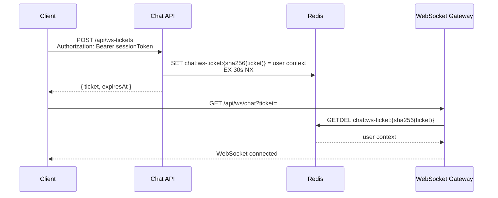

# WebSocket One-Time Ticket 보안 Hardening Gate 검토

## 1. 결론

WebSocket one-time ticket은 **Phase 2에 포함하지 않고 별도 Security Hardening task로 분리**한다.
다만 이 작업은 선택 사항이 아니라, **Phase 2 완료 후 운영 공개 전 반드시 통과해야 하는 release gate**로 둔다.

Phase 2의 본래 범위는 메시지 계약, `messageId`, `clientMessageId`, `roomSeq`, idempotency, ACK/batch frame 계약 정리다. WebSocket ticket은 인증/토큰 노출면을 줄이는 보안 hardening 성격이므로 Phase 2 본류에 섞으면 범위가 커지고 리뷰 초점이 흐려질 수 있다.

권장 순서는 다음과 같다.

1. Phase 2: 메시지 계약, sequence, idempotency 확정
2. Security Hardening Gate: WebSocket one-time ticket 도입
3. Phase 3 이후: Redis Streams ingest, worker, fan-out 확장 진행

> Phase 2 이후 바로 운영 트래픽을 열 계획이라면, 이 gate는 Phase 2와 병렬로 준비하되 merge/release 기준은 별도 보안 task로 관리한다.

---

## 2. 현재 상태 요약

| 항목                         | 현재 구현                                                                          |
|----------------------------|--------------------------------------------------------------------------------|
| REST 인증                    | `Authorization: Bearer <sessionToken>` 기반                                      |
| WebSocket 인증               | handshake에서 session token 검증 후 `userId`를 session attribute에 저장                 |
| Browser WebSocket token 전달 | Browser WebSocket API 제약 때문에 URL query parameter 사용                            |
| 토큰 종류                      | 자체 HMAC-SHA256 서명 토큰, 형식: `v1.<base64url-payload>.<base64url-signature>`       |
| 기본 토큰 TTL                  | 12시간                                                                           |
| 토큰 재사용                     | REST API와 WebSocket에서 동일 session token 재사용                                     |
| 로그 보호                      | Nginx access log는 `$request_method $uri $server_protocol`만 기록해 query string 제외 |
| 토큰 폐기                      | 미지원, stateless 검증                                                              |
| One-time ticket            | 미구현                                                                            |
| 재연결                        | 클라이언트 exponential backoff, 재연결 시 현재는 동일 session token 재사용                      |

현재 Phase 1에서 가장 직접적인 유출 경로였던 Nginx access log의 query string 기록은 완화되어 있다. 그러나 reusable session token이 WebSocket URL에 들어가는 구조 자체는 아직 남아 있다.

---

## 3. 현재 위험 요소

현재 구조에서 `sessionToken`이 URL에 노출될 수 있는 경로는 다음과 같다.

1. 브라우저 개발자 도구 Network 탭
2. 브라우저 확장 프로그램 또는 로컬 진단 도구
3. Nginx 앞단에 추가될 수 있는 CDN, WAF, L7 Load Balancer 로그
4. 애플리케이션 또는 프레임워크의 request URI debug log
5. 장애 분석용 packet/request capture
6. APM, tracing, error reporting 도구의 request URL 수집

일반적인 WebSocket handshake에서 `Referer`가 핵심 유출 경로라고 보기는 어렵지만, 운영 환경의 프록시/보안 장비/관측 도구가 전체 URL을 수집할 가능성은 남아 있다.

> [!WARNING]
> 현재 WebSocket URL에 들어가는 값은 12시간 TTL의 재사용 가능한 session token이다. 이 값이 한 번 유출되면 만료 전까지 공격자가 같은 사용자로 REST API와 WebSocket을 모두 사용할 수 있다.

---

## 4. One-Time Ticket 방식

One-time ticket은 reusable session token을 WebSocket URL에 직접 넣지 않기 위한 짧은 수명, 단일 사용 인증 값이다.



Redis `GETDEL`을 사용할 수 없는 환경이면 Lua script로 read-and-delete를 원자적으로 처리한다. 핵심은 `GET` 후 `DEL`을 따로 호출하지 않는 것이다. 두 명령이 분리되면 같은 ticket을 동시에 재사용하는 race condition이 생길 수 있다.

| 속성                 | 현재 Session Token 방식    | One-Time Ticket 방식                 |
|--------------------|------------------------|------------------------------------|
| WebSocket URL 포함 값 | reusable session token | WebSocket 전용 ticket                |
| 유효 기간              | 기본 12시간                | 15~30초 권장                          |
| 사용 횟수              | TTL 내 무제한              | 1회                                 |
| 권한 범위              | REST + WebSocket 전체    | WebSocket handshake 1회             |
| 저장 방식              | Stateless HMAC 검증      | Redis state 필요                     |
| URL 유출 영향          | TTL 동안 계정 권한 탈취 가능     | 미사용 ticket도 짧은 시간 뒤 만료, 사용 후 즉시 무효 |

---

## 5. Phase 2 포함 여부 검토

### 선택지 A. Phase 2에 포함

장점:
- WebSocket 인증 변경을 Phase 2 테스트 범위에 함께 넣을 수 있다.
- Phase 2에서 인증 체계까지 재설계한다면 ticket 발급 API를 함께 확정할 수 있다.

단점:
- 현재 Phase 2 범위와 직접 관련이 없다.
- 메시지 계약, sequence, idempotency 정리의 리뷰 초점이 흐려진다.
- 보안 변경이 기능 변경과 섞여 롤백 단위가 커진다.
- Phase 2 일정이 보안 hardening 작업에 의해 지연될 수 있다.

Phase 2에 포함해도 되는 조건:
- Phase 2 범위를 인증 체계 개편까지 명시적으로 확장하는 경우
- refresh token, token revocation, OIDC 전환 같은 인증 작업이 Phase 2에 이미 포함되는 경우
- 운영 공개 일정 때문에 Phase 2 merge 직후 바로 보안 gate까지 같이 닫아야 하는 경우

현재 설계문서 기준으로는 위 조건에 해당하지 않는다.

### 선택지 B. 별도 Security Hardening task로 분리

장점:
- Phase 2 범위를 메시지 계약 정리로 유지할 수 있다.
- 보안 리뷰가 handshake, token 노출, ticket TTL, 재사용 방지에 집중된다.
- 별도 PR로 테스트/롤백/검증 기준을 명확히 둘 수 있다.
- Phase 2 완료 후 운영 전 release gate로 강제하기 좋다.

단점:
- 별도 task로 빠지면 우선순위가 밀릴 위험이 있다.
- Phase 2 변경 후 WebSocket client/server 코드를 다시 수정해야 한다.

최종 선택:

**선택지 B를 채택한다.** 단, backlog성 개선으로 두지 않고 **Phase 2 Done 이후 Production Ready 판정 전 필수 gate**로 둔다.

---

## 6. Security Hardening Task 정의

```markdown
## [Security] WebSocket one-time ticket 도입

### 목적
Browser WebSocket 연결에서 reusable session token을 URL query parameter로 전달하지 않도록 한다.
session token은 REST API의 Authorization header에만 사용하고, WebSocket URL에는 짧은 TTL의 단일 사용 ticket만 포함한다.

### 범위
- [ ] `POST /api/ws-tickets` 엔드포인트 추가
- [ ] session token 인증 후 WebSocket 전용 ticket 발급
- [ ] ticket 원문이 아닌 `sha256(ticket)` 기준으로 Redis 저장
- [ ] Redis key TTL 15~30초 적용
- [ ] ticket consume은 `GETDEL` 또는 Lua script로 원자 처리
- [ ] ticket value에는 `userId`, 발급 시각, 만료 시각, 필요 시 client/session metadata 저장
- [ ] WebSocket handshake는 production profile에서 `ticket`만 허용
- [ ] 기존 `token` query parameter는 local/dev 전환 기간에만 허용하거나 제거
- [ ] 클라이언트는 WebSocket connect/reconnect 직전에 ticket을 발급받도록 수정
- [ ] 재연결 시 기존 ticket 재사용 금지
- [ ] ticket 발급 endpoint rate limit 추가
- [ ] ticket 발급/소비/만료/재사용 실패 metrics 추가
- [ ] OpenAPI, configuration, verify script 갱신
- [ ] 통합 테스트와 보안 회귀 테스트 추가

### 선행 조건
- Phase 2 완료
- WebSocket message envelope와 reconnect/gap fill 계약 확정

### 완료 기준
- session token이 WebSocket URL에 포함되지 않는다.
- 사용 완료된 ticket 재사용 시 handshake가 실패한다.
- 만료된 ticket 사용 시 handshake가 실패한다.
- Redis 장애 또는 ticket 저장 실패 시 fail-closed로 동작한다.
- Nginx, application log, verify script output에 session token/ticket 원문이 남지 않는다.
- `mise run verify:chat` 또는 대체 E2E 검증이 one-time ticket flow로 통과한다.
```

---

## 7. 설계 세부안

### API

```http
POST /api/ws-tickets
Authorization: Bearer <sessionToken>
Content-Type: application/json
```

응답:

```json
{
  "ticket": "base64url-random-256bit",
  "expiresAt": "2026-06-12T12:00:30Z"
}
```

ticket은 충분한 entropy를 가진 random value여야 한다. UUID만 사용하기보다는 256-bit secure random 값을 base64url로 인코딩하는 방식을 권장한다.

### Redis key

```text
chat:ws-ticket:{sha256(ticket)} -> {
  "userId": 123,
  "issuedAt": "2026-06-12T12:00:00Z",
  "expiresAt": "2026-06-12T12:00:30Z"
}
TTL: 30s
```

ticket 원문은 Redis에 저장하지 않는다. 로그나 Redis dump가 유출되더라도 즉시 ticket으로 사용할 수 없게 하기 위함이다.

### Handshake 검증

검증 순서:

1. query parameter에서 `ticket` 추출
2. `sha256(ticket)` 계산
3. Redis에서 atomic consume
4. 값이 없으면 `401 Unauthorized`
5. 값이 있으면 `userId`를 WebSocket session attribute에 저장
6. 이후 메시지 처리에서는 query parameter의 사용자 식별 값을 신뢰하지 않음

### Rate Limit

ticket 발급 API는 session token 인증 뒤에도 rate limit이 필요하다.

권장 기본값:

| 기준               | 기본값                 | 이유                  |
|------------------|---------------------|---------------------|
| user 기준          | 10 tickets / minute | reconnect storm 완화  |
| IP 기준            | 60 tickets / minute | 인증된 token 탈취/자동화 방어 |
| room 입장 직후 burst | 짧은 burst 허용         | 정상 reconnect UX 보호  |

운영에서 매우 불안정한 네트워크 사용자가 많다면 user 기준 limit은 완화하되, IP/ASN/abuse signal 기반 제한을 함께 둔다.

---

## 8. 테스트 기준

### 단위 테스트

- ticket 발급 시 Redis key TTL이 설정된다.
- ticket 원문이 Redis key/value에 저장되지 않는다.
- 같은 ticket을 두 번 consume하면 두 번째는 실패한다.
- 만료된 ticket은 실패한다.
- malformed ticket은 실패한다.
- Redis write/read 실패 시 인증 성공으로 처리하지 않는다.

### 통합 테스트

- `Authorization: Bearer sessionToken`으로 ticket 발급 성공
- 발급된 ticket으로 WebSocket 연결 성공
- 동일 ticket 재사용 시 WebSocket 연결 실패
- 새 ticket 발급 후 재연결 성공
- session token query parameter만으로는 production profile WebSocket 연결 실패
- Nginx access log에 query string이 기록되지 않음

### 운영 검증

- access log, application log, tracing span attribute에서 `sessionToken`과 `ticket` 원문이 수집되지 않음
- ticket issue/consume/reuse/expired 카운터가 dashboard에 표시됨
- Redis latency 증가 시 WebSocket handshake p95/p99가 관측됨
- Redis 장애 시 ticket 발급/handshake가 fail-closed로 실패하고 알림이 발생함

---

## 9. 복잡도

일반적인 요청 1건 기준:

- ticket 발급 시간 복잡도: `O(1)`
- ticket 소비 시간 복잡도: `O(1)`
- ticket 저장 공간 복잡도: `O(A)`

여기서 `A`는 아직 만료되거나 사용되지 않은 active ticket 수다. TTL을 30초로 두면 저장량은 대략 `ticket 발급 TPS * 30초` 수준으로 제한된다.

예를 들어 ticket 발급이 초당 1,000건이고 TTL이 30초라면 Redis에는 정상 상태에서 약 30,000개 ticket key가 존재할 수 있다.

---

## 10. 주의사항

> - `GET` 후 `DEL`을 분리하면 one-time 보장이 깨질 수 있다. 반드시 `GETDEL` 또는 Lua script로 원자 consume해야 한다.
> - ticket TTL이 너무 짧으면 모바일 네트워크나 proxy handshake 지연에서 실패가 늘 수 있다. 기본 30초에서 시작하고 지표 기반으로 조정한다.
> - ticket query parameter도 민감정보로 취급해야 한다. session token보다 위험이 낮을 뿐이며, 로그에는 남기지 않는 것이 원칙이다.
> - Redis 장애 시 보안을 위해 fail-open이 아니라 fail-closed로 처리해야 한다. 단, 이 경우 WebSocket 신규 연결 장애가 발생하므로 알림과 runbook이 필요하다.
> - production에서 `token` query fallback을 계속 열어두면 one-time ticket 도입 효과가 크게 줄어든다.

---

## 11. 대안

| 대안                              | 장점                                                | 단점                                                 | 판단               |
|---------------------------------|---------------------------------------------------|----------------------------------------------------|------------------|
| 현재 방식 유지 + log scrub 강화         | 구현 비용이 가장 낮다                                      | session token이 URL에 들어가는 구조가 계속 남는다                | 운영 전 기준으로는 부족    |
| WebSocket subprotocol에 token 전달 | URL query 노출을 줄일 수 있다                             | Browser/프록시/서버 지원과 로깅 정책이 복잡하고 표준적인 인증 경로로 보기 애매하다 | 보조 대안            |
| Cookie 기반 WebSocket 인증          | URL 노출이 없다                                        | CSRF/Origin 검증/SameSite/CORS 정책을 더 엄격히 설계해야 한다     | 별도 인증 체계 개편 시 검토 |
| One-time ticket                 | URL에 reusable token이 노출되지 않고 클러스터에서도 Redis로 검증 가능 | Redis 의존성과 발급 API가 추가된다                            | 현재 권장안           |

---

## 12. 남은 확인 사항

- production profile에서 기존 `token` query fallback을 완전히 제거할지, 짧은 전환 기간 동안 feature flag로 둘지 결정해야 한다.
- ticket TTL 기본값을 15초로 둘지 30초로 둘지 결정해야 한다. 초기값은 30초를 권장한다.
- ticket 발급 rate limit 저장소를 Redis로 둘지, 기존 rate limit 컴포넌트가 생긴 뒤 통합할지 결정해야 한다.
- `POST /api/ws-tickets`를 `chat-api-application`에 둘지, 장기적으로 별도 auth module로 분리할지 결정해야 한다.
- E2E 검증 스크립트에서 ticket 원문을 출력하지 않도록 masking 규칙을 함께 적용해야 한다.

---

## 13. 후속 질문 (Next Questions)

- Phase 2 완료 후 이 Security Hardening Gate를 Phase 2.5처럼 별도 마일스톤으로 문서화할까?
- production에서는 `token` query fallback을 즉시 제거하고, local/dev에서만 허용하는 방식으로 갈까?
- ticket TTL은 기본 30초로 시작하고 운영 지표로 줄이는 방향이 좋을까?
